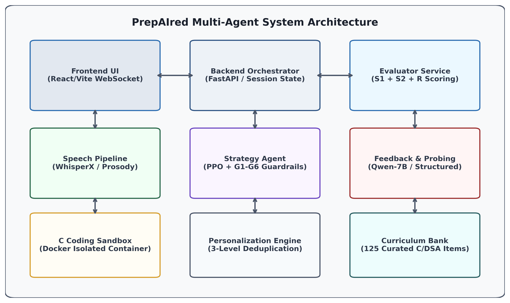

# PrepAIred — A Personalized Adaptive Framework for Multimodal Technical Interview Assessment and Preparation

[](docs/paper_draft_ieee.md)
[](docs/PAPER_RESULTS_TRACEABILITY.md)
[](docs/SYSTEM_TESTING.md)
[](docs/REPRODUCIBILITY.md)
[](LICENSE)

> **PrepAIred** is an integrated, multimodal, closed-loop adaptive technical interview assessment platform for computer science education. It integrates speech prosody analysis, neural short-answer grading ($S_1+S_2+R$), isolated Docker C execution, and guardrail-augmented Proximal Policy Optimization (PPO) difficulty adaptation.

---

## System Architecture



---

## Key Research Findings (Pre-Registered $n=480$ Evaluations)

1. **Adaptive Difficulty Adaptation (EXP-1, $n=150$):** PPO with safety guardrails achieves statistically significant positive difficulty adaptation ($\rho = +0.1572 \pm 0.08$) relative to static fixed ($\rho = 0.0, p = 6.15 \times 10^{-4}$) and heuristic rule-based controllers ($\rho = -0.2572, p = 5.30 \times 10^{-8}$) in simulation.
2. **Neural Answer Evaluation (EXP-2, $n=140$):** The multi-component scoring pipeline ($S_1+S_2+R$) achieves strong rank correlation ($\rho = 0.8358, p = 4.46 \times 10^{-6}, \text{MAE} = 0.2585$) with blinded human expert ratings on a 20-sample pilot benchmark (human inter-rater reliability Krippendorff's $\alpha = 0.8255$).
3. **Formative Feedback Trade-Offs (EXP-3, $n=60$):** Generative `Qwen2.5-7B-Instruct` (Tesla T4 GPU) exhibits higher transcript lexical grounding ($0.2496$ vs. $0.0383, p = 2.56 \times 10^{-3}$), while deterministic structured recovery guarantees strictly superior rubric gap coverage ($100.0\%$ vs. $72.5\%, p = 9.11 \times 10^{-4}$) at sub-50ms latency.
4. **Personalization & Deduplication (EXP-4, $n=60$):** 3-level deduplication completely eliminates question repetition ($0.0\%$ vs. $6.0\%, p < 0.001$), producing distinct trajectory divergence ($d = 14.21$) between candidate ability profiles in simulation.
5. **System Behavioral Decoupling (EXP-5, $n=70$):** 100% clean subsystem isolation confirmed across 7 leave-one-out conditions without cascading crashes.

*Scientific Boundary: Candidate learning gains, anxiety reduction, and whole-system hiring efficacy represent future longitudinal classroom trials.*

---

## Dual Configuration Architecture

```
================================================================================
CONFIG A: RESEARCH SCIENTIFIC EVIDENCE (EXP-3)
================================================================================
- Model: Qwen/Qwen2.5-7B-Instruct (bfloat16) on NVIDIA Tesla T4 GPU (CUDA 12.8)
- Model Revision: a09a35458c702b33eeacc393d103063234e8bc28
- Measured Latency: 9.78s per turn (Grounding = 0.2496, Gap Coverage = 72.5%)
- Immutable Raw Data: research/results/raw/experiment_3_qwen_raw.json
- Scope: Frozen scientific evidence supporting the manuscript.
================================================================================

================================================================================
CONFIG B: LIVE DEMO & CLASSROOM DEPLOYMENT (CPU-ONLY)
================================================================================
- Model: Qwen/Qwen2.5-1.5B-Instruct-GGUF (Q4_K_M, 986 MB)
- Runtime Engine: llama.cpp / llama-cpp-python (CPU-Only, 12 threads)
- Measured Latency: ~1.8s - 2.9s per task (Mean = 2.195s, 18.79 tok/s)
- Process RAM: ~1.36 GB RSS
- Fallback System: Sub-50ms deterministic rubric-grounded recovery
- License: Apache-2.0
================================================================================
```

---

## Quick Start — Local CPU Live Demo

### 1. Setup Environment & Install Dependencies
```bash
# Clone repository
git clone https://github.com/your-username/PrepAIred.git
cd PrepAIred

# Install backend dependencies
pip install -r requirements.txt
pip install llama-cpp-python --extra-index-url https://abetlen.github.io/llama-cpp-python/whl/cpu
```

### 2. Download Quantized GGUF Model (986 MB)
```bash
python -c "
from huggingface_hub import hf_hub_download
from pathlib import Path
out_dir = Path('models/gguf')
out_dir.mkdir(parents=True, exist_ok=True)
hf_hub_download(
    repo_id='Qwen/Qwen2.5-1.5B-Instruct-GGUF',
    filename='qwen2.5-1.5b-instruct-q4_k_m.gguf',
    local_dir=str(out_dir)
)
print('Model ready for local CPU inference.')
"
```

### 3. Launch Services
```bash
# Terminal 1: Qwen Microservice (Port 8001)
python services/qwen/app.py

# Terminal 2: Evaluator Microservice (Port 5000)
python services/evaluator/app.py

# Terminal 3: FastAPI Backend (Port 8000)
uvicorn apps.backend.main:app --reload --port 8000

# Terminal 4: React Frontend (Port 5173)
cd apps/web && npm install && npm run dev
```

---

## Research Reproduction

To deterministically verify all 480 experimental evaluations and regenerate Figures 1–8:
```bash
python scripts/reproduce_paper.py
```

### Running Automated Test Suites
```bash
# Backend unit and integration regression suite (178 tests)
pytest tests/ -v

# Frontend component suite (7 tests)
cd apps/web && npm test -- --run
```

---

## Repository Structure

```
PrepAIred/
├── ablation/                  # Human evaluation benchmark & Krippendorff alpha analysis
├── agents/                    # Multi-agent orchestrator, strategy, audio, timing, selector
├── apps/
│   ├── backend/               # FastAPI WebSocket & REST API backend
│   └── web/                   # React 18 / Vite frontend client
├── data/
│   ├── questions/             # 125 curated technical interview questions (qns.json)
│   └── rubrics/               # 125 fine-grained evaluation rubrics
├── docs/                      # Authoritative research paper, booklet, audits, traceability
│   ├── paper_draft_ieee.md    # Authoritative IEEE scientific manuscript
│   ├── PREPAIRED_COMPLETE_BOOKLET.md # Master 34-part academic & viva defense guide
│   ├── PAPER_RESULTS_TRACEABILITY.md # 100% dataflow traceability matrix
│   ├── CLAIMS_CHECK.md        # Master claims evidence ledger (16 rows)
│   ├── SYSTEM_TESTING.md      # Full test execution report
│   ├── live_demo_verification.md # CPU live demo setup & benchmark guide
│   └── REPRODUCIBILITY.md     # Master replication instructions
├── experiments/               # Pre-registered experimental execution harnesses (EXP 1-5)
├── models/                    # GGUF model storage (excluded from git)
├── research/results/          # Machine-readable raw data, processed CSVs, tables, and figures
├── rl/                        # Gymnasium environment, PPO training, and checkpoints
├── scripts/                   # One-click paper replication harness (reproduce_paper.py)
├── services/                  # Standalone Evaluator and Qwen microservices
├── submission/                # Self-contained venue submission package (IEEE TLT)
├── tests/                     # 178 unit & integration regression tests
├── Dockerfile.sandbox         # Isolated C execution sandbox container
├── docker-compose.yml         # Full multi-container orchestration
└── README.md                  # Master repository documentation
```

---

## Licenses

- **Platform Code:** MIT License ([LICENSE](LICENSE))
- **Qwen2.5-1.5B-Instruct-GGUF:** Apache-2.0 License
- **Qwen2.5-7B-Instruct:** Apache-2.0 License
- **Sentence-Transformers (MiniLM):** Apache-2.0 License

---

## Citation

```bibtex
@article{kumar2026prepaired,
  title={A Personalized Adaptive Framework for Multimodal Technical Interview Assessment and Preparation},
  author={Kumar, Sparsh and PrepAIred Research Group},
  journal={IEEE Transactions on Learning Technologies (Under Review)},
  year={2026}
}
```
