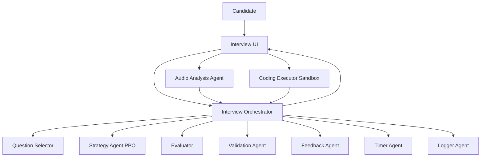

# PrepAIred

Adaptive AI interview preparation platform with multi-agent orchestration, reinforcement-learning-based difficulty control, voice and code evaluation, and structured formative feedback.

## Table of Contents

- [Overview](#overview)
- [Key Features](#key-features)
- [Repository Structure](#repository-structure)
- [Architecture](#architecture)
- [Architecture Diagram / Image](#architecture-diagram--image)
- [Agents and Main Modules](#agents-and-main-modules)
- [RL Method (Brief)](#rl-method-brief)
- [Services and Ports](#services-and-ports)
- [Docker](#docker)
- [Quick Demo](#quick-demo)
- [Interactive Demo](#interactive-demo)
- [API Endpoints (Backend)](#api-endpoints-backend)
- [API Endpoints (Evaluator)](#api-endpoints-evaluator)
- [API Endpoints (Qwen Service)](#api-endpoints-qwen-service)
- [Setup](#setup)
- [Running the Project](#running-the-project)
- [Typical Interview Flow](#typical-interview-flow)
- [Logging and Outputs](#logging-and-outputs)
- [Research Artifacts](#research-artifacts)
- [Model and Dataset Cards](#model-and-dataset-cards)
- [Human Evaluation Workflow](#human-evaluation-workflow)
- [Large Artifacts and Release Handling](#large-artifacts-and-release-handling)
- [Contributing](#contributing)
- [Citation](#citation)
- [Known Improvement Areas](#known-improvement-areas)
- [License](#license)

## Overview

PrepAIred is an end-to-end system for technical interview practice (C and DSA focused) that runs a live, adaptive interview loop:

1. Ask a question from the curated bank.
2. Accept candidate response (voice/text/code).
3. Evaluate content quality and reasoning.
4. Validate/adjust score with guardrails.
5. Generate actionable feedback.
6. Adapt next-step strategy using RL policy.
7. Repeat until session end and generate final report.

The platform is designed around an orchestrator-centered multi-agent architecture so each component has a focused responsibility.

## Key Features

- Adaptive interview progression with PPO strategy + guardrails
- Baseline warm-up phase before RL activation
- Voice pipeline with confidence and hesitation signals
- Coding sandbox with safety checks and timeout control
- Multi-component evaluator (semantic, concept, reasoning)
- Validation layer for post-hoc score correction
- Rich per-turn feedback (strengths, misses, misconceptions, tips)
- Session logging and analytics
- Real-time WebSocket interview experience
- Unified launcher for all services

## Repository Structure

The maintained source tree is documented in [docs/FOLDER_STRUCTURE_FINAL.md](docs/FOLDER_STRUCTURE_FINAL.md).

In short, the active codebase is centered on:

- `apps/backend/` for the FastAPI + WebSocket API
- `apps/web/src/` for the React/Vite frontend
- `agents/` for orchestration, strategy, validation, timing, audio, and code execution
- `services/` for the evaluator and Qwen microservices
- `rl/` for PPO training assets and checkpoints
- `data/` for questions, rubrics, sessions, reports, and vector stores
- `tests/` for unit and integration coverage
- `docs/` for architecture, runbooks, diagrams, and paper drafts
- `requirements/`, `launch.py`, `pyproject.toml`, and `.env.example` for setup and execution

## Architecture

### Core Control

- **InterviewOrchestrator** coordinates session lifecycle and agent calls.
- **Strategy agent** suggests next action: Easier / Same / Harder.
- **Question selector** chooses next question by difficulty/topic constraints.

### Evaluation Layer

- **Evaluator** computes semantic, concept, and reasoning scores.
- **Validation agent** applies guardrails and score adjustments.
- **Coding executor** runs code in sandboxed process with test cases.

### Output Layer

- **Feedback agent** produces structured, actionable feedback.
- **Logger** stores turn-level events and session summaries.
- **Report generation** compiles full session outcomes.

### Audio Layer

- Speech-to-text
- Prosodic features
- Confidence/hesitation scoring
- RL state-signal extraction

## Architecture Diagram / Image

### Mermaid Diagram



### Add Your Diagram Images

If you want static architecture images in GitHub preview, place images under `docs/diagrams/` and add links like:

```markdown


```

## Agents and Main Modules

- Orchestrator: `agents/orchestrator/interview_orchestrator.py`
- Strategy (RL): `agents/strategy/hybrid_orchestrator.py`
- Feedback: `agents/orchestrator/feedback_agent.py`
- Evaluator API: `services/evaluator/app.py`
- Audio pipeline: `agents/audio/main.py`
- Validation: `agents/validation/score_validator.py`
- Timer: `agents/timing/timer.py`
- Code sandbox: `agents/coding_executor/coding_executor.py`
- Backend server: `apps/backend/main.py`
- Qwen service: `services/qwen/app.py`

## RL Method (Brief)

- Algorithm: PPO (Stable-Baselines3)
- State (6D): performance, rolling average, confidence, hesitation, time_norm, difficulty
- Actions (3): Easier, Same, Harder
- Baseline phase: deterministic initial questions before RL control
- Runtime safety: post-policy guardrails to prevent unstable actions
- Trained artifacts: `rl/checkpoints/seed_123/ppo_final.zip`, `vecnormalize.pkl`

Hints and follow-up questions remain available as auxiliary support through Qwen/orchestrator flows, but they are not part of the RL action space.

## Services and Ports

`launch.py` starts these services in order:

1. Evaluator API: `http://localhost:5000`
2. Qwen microservice (optional, single-model): `http://localhost:8001`
3. Backend API/WebSocket: `http://localhost:8000`
4. Frontend dev server (optional): usually `http://localhost:5173`

## Quick Demo

Run these exact commands in Windows PowerShell from repository root.

### 1) Activate environment

```powershell
.\.venv\Scripts\Activate.ps1
```

### 2) Install dependencies (one-time)

```powershell
python -m pip install --upgrade pip
python -m pip install -r requirements\backend.txt
python -m pip install -r requirements\evaluator.txt
python -m pip install -r requirements\rl.txt
cd apps\web
npm install
cd ..\..
```

### 3) Launch full stack

```powershell
python launch.py
```

### 4) Open app

- Frontend: `http://localhost:5173`
- Backend health: `http://localhost:8000/health`

### 5) API-only demo (no Qwen, no frontend)

```powershell
python launch.py --backend-only
```

### 6) Smoke-test key endpoints

```powershell
curl http://localhost:8000/health
curl http://localhost:5000/api/evaluator/current-question
```

## Interactive Demo

The frontend includes a small self-contained demo screen that shows the adaptive interview loop without needing to start a full session.

From the login screen, choose **View interactive demo**. You can also open it from the top navigation once you are inside the app.

The demo highlights:

- one sample interview question,
- a sample candidate answer,
- a compact evaluator summary,
- a difficulty slider showing the 3-action policy output.

## API Endpoints (Backend)

From `apps/backend/main.py`:

- `GET /health`
- `POST /api/login`
- `POST /api/sessions`
- `GET /api/sessions/{session_id}`
- `POST /api/sessions/{session_id}/end`
- `GET /api/sessions/{session_id}/report`
- `POST /api/transcribe`
- `POST /api/run_code`
- `GET /api/admin/sessions`
- `GET /api/admin/stats`
- `GET /api/admin/sessions/{session_id}`
- `WS /ws/interview/{session_id}`

## API Endpoints (Evaluator)

From `services/evaluator/app.py`:

- `POST /api/evaluator/set-question`
- `POST /api/evaluator/evaluate-answer`
- `GET /api/evaluator/last-result`
- `GET /api/evaluator/current-question`

## API Endpoints (Qwen Service)

From `services/qwen/app.py`:

- `GET /health`
- `POST /hint`
- `POST /followup`
- `POST /partial_eval`
- `POST /report`

The Qwen service is intentionally kept as a single model tier so the runtime stays simpler to explain, easier to validate, and easier to keep consistent across prompts.

## Docker

The repo includes a Docker-based stack for local development and review. The default Compose setup starts the evaluator, backend, and frontend without requiring the large Qwen weights.

```powershell
docker compose up --build
```

To enable the optional Qwen service, use the profile-based variant:

```powershell
docker compose --profile qwen up --build
```

For the full container layout and service responsibilities, see [docs/DOCKER.md](docs/DOCKER.md).

## Setup

### Prerequisites

- Python 3.11+ (3.12 works for most components)
- Node.js 18+
- npm
- Optional GPU for local LLM acceleration

### 1) Create and activate virtual environment

Windows PowerShell:

```powershell
python -m venv .venv
.\.venv\Scripts\Activate.ps1
python -m pip install --upgrade pip
```

### 2) Install Python dependencies

```powershell
python -m pip install -r requirements\backend.txt
python -m pip install -r requirements\evaluator.txt
python -m pip install -r requirements\rl.txt
```

If FAISS install fails on Windows:

1. Use conda package for `faiss-cpu`, or
2. Use Python 3.11 specifically for evaluator stack

### 3) Install frontend dependencies

```powershell
cd apps\web
npm install
cd ..\..
```

## Running the Project

### Recommended (single command)

```powershell
python launch.py
```

Options:

```powershell
python launch.py --no-qwen
python launch.py --no-frontend
python launch.py --backend-only
```

### Manual startup (advanced)

Terminal 1:

```powershell
cd services\evaluator
python app.py
```

Terminal 2:

```powershell
cd services\qwen
python -m uvicorn app:app --host 0.0.0.0 --port 8001
```

Terminal 3:

```powershell
cd apps\backend
python -m uvicorn main:app --reload --host 0.0.0.0 --port 8000
```

Terminal 4:

```powershell
cd apps\web
npm run dev
```

## Typical Interview Flow

1. User logs in and starts session.
2. Orchestrator sends first question.
3. Candidate answers via voice or code.
4. Evaluation + validation + feedback pipeline executes.
5. Strategy agent adapts difficulty/action.
6. Next question sent over WebSocket.
7. Final report generated at session end.

## Logging and Outputs

- Launcher logs: `logs/<service>.log`
- Evaluator session/result JSON outputs under evaluator directories
- Orchestrator logs/session analytics under orchestrator logging paths
- RL artifacts and training logs under `rl_agent/rl_runs/`

## Research Artifacts

The authoritative human-evaluation workflow is documented in [ablation/HUMAN_EVAL_README.md](ablation/HUMAN_EVAL_README.md).

The generated per-topic summary tables live under [ablation/results/topic_analysis_summary.md](ablation/results/topic_analysis_summary.md) and are produced by [ablation/topic_analysis_tables.py](ablation/topic_analysis_tables.py).

## Model and Dataset Cards

- [docs/MODEL_CARD.md](docs/MODEL_CARD.md): high-level description of the adaptive interview system
- [docs/DATASET_CARD.md](docs/DATASET_CARD.md): question bank and rating dataset description
- [docs/HUMAN_RATER_PACK.md](docs/HUMAN_RATER_PACK.md): ready-to-send instructions for external raters

## Human Evaluation Workflow

Use these commands when teammates need to collect ratings, aggregate them, and regenerate the ablation figures.

```powershell
# 1) Collect one rater CSV at a time
.\.venv\Scripts\Activate.ps1
python ablation\web_rater.py --answers ablation\data\ablation_answers.json --out ablation\results\ratings_rater1.csv

# 2) Repeat for additional raters
python ablation\web_rater.py --answers ablation\data\ablation_answers.json --out ablation\results\ratings_rater2.csv
python ablation\web_rater.py --answers ablation\data\ablation_answers.json --out ablation\results\ratings_rater3.csv

# 3) Aggregate and re-run analysis
python ablation\run_human_eval_pipeline.py --no-synthetic --ratings ablation\results\ratings_rater1.csv ablation\results\ratings_rater2.csv ablation\results\ratings_rater3.csv
```

For offline testing only, run the synthetic pipeline instead:

```powershell
python ablation\run_human_eval_pipeline.py --use-synthetic
```

For a teammate-ready handout, use [docs/HUMAN_RATER_PACK.md](docs/HUMAN_RATER_PACK.md) and keep one CSV per person.

## Large Artifacts and Release Handling

Large model weights, generated artifacts, and other bulky files should not be pushed directly into the main repo history. The repository includes a Git LFS migration guide at [docs/GIT_LFS_MIGRATION.md](docs/GIT_LFS_MIGRATION.md).

Recommended approach:

1. Track large patterns with Git LFS or keep them out of Git entirely.
2. Mount or download model weights at runtime.
3. Publish heavyweight artifacts in a separate release, dataset page, or object store.
4. Keep the repository itself limited to source, configs, scripts, figures, and lightweight summaries.

**Human evaluation pipeline:** see `ablation/HUMAN_EVAL_README.md` for an interactive rater harness, synthetic-proxy generator for testing, averaging scripts, and analysis commands used to produce the figures in `ablation/results/`.

Draft manuscripts:

- `research/papers/paper_systems_agentic_architecture.md`
- `research/papers/paper_rl_adaptive_assessment.md`
- `research/papers/paper_aied_multiagent_feedback.md`

Capstone report:

- `research/capstone/PrepAIred_Capstone_Report_Phase2.md`

## Contributing

Contributions are welcome for research and engineering improvements.

1. Fork the repository.
2. Create a feature branch.
3. Keep changes focused and include tests where possible.
4. Run backend/frontend locally and verify no regressions.
5. Open a pull request with a clear summary and validation steps.

Suggested contribution areas:

- RL policy evaluation and ablations
- Evaluator quality and rubric alignment
- Frontend UX and accessibility
- Reliability, monitoring, and test coverage
- Documentation and reproducibility scripts

## Citation

If you use PrepAIred in academic work, cite it as:

```bibtex
@misc{prepaired2026,
	title        = {PrepAIred: Adaptive Interview Preparation with Multi-Agent Orchestration and RL-Guided Strategy},
	author       = {PrepAIred Project Team},
	year         = {2026},
	howpublished = {GitHub repository},
	note         = {Includes orchestrator architecture, evaluator pipeline, and adaptive interview loop}
}
```

## Known Improvement Areas

- Unify dependency entrypoints (root requirements path consistency)
- Add reproducible one-click setup scripts for all platforms
- Expand integration tests for service combinations and failure paths
- Add fairness and robustness benchmarking for audio-heavy scenarios
- Add formal experiment scripts for publication-ready reproducibility

## License

Add your preferred license file (for example MIT/Apache-2.0) if you plan to open-source publicly.
