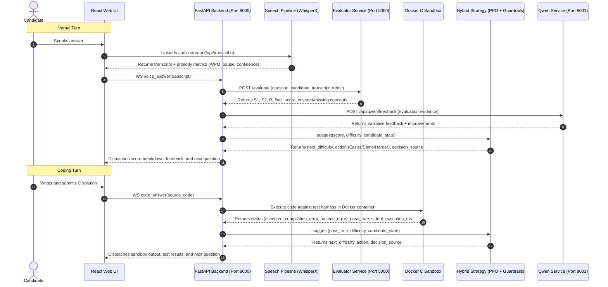

# PrepAIred — System Architecture Specification

**Document Version:** 2.0.0 (Authoritative Stage 13 Consolidation)
**System:** PrepAIred Automated Technical Interview & Adaptive Assessment Platform

---

## 1. Architectural Philosophy

PrepAIred implements an **orchestrator-centered multi-agent architecture** designed for real-time technical interview assessment (C programming and Data Structures & Algorithms). The core design principles are:

1. **Strict Decoupling of Concerns:** Evaluation, difficulty strategy, audio prosody extraction, coding sandbox execution, and feedback synthesis operate as independent services/agents coordinated by a central session orchestrator.
2. **Authoritative Scoring Dominance:** The multi-component neural evaluator ($S_{\text{tech}} \in [0, 1]$) serves as the uncompromised ground truth. Response timing ($f_{\text{time}} \in [-0.10, +0.03]$) modifies the final score without inflating incorrect responses.
3. **Transparent Traceability:** Every runtime decision (question selection, difficulty adjustment, follow-up injection, feedback synthesis) records its exact `decision_source` and `llm_status` / `rl_status` to ensure post-hoc auditable accountability.
4. **Resilient Offline Degradation:** If optional external microservices (Qwen LLM, WhisperX GPU) are unavailable, the system transparently falls back to evidence-grounded non-LLM structured recovery without fabricating data or mislabeling attribution.

---

## 2. System Topology & Microservices

The PrepAIred ecosystem consists of four decoupled runtime layers communicating over asynchronous HTTP and persistent WebSockets:

```
                                  ┌────────────────────────┐
                                  │   React / Vite Web UI  │
                                  │       (Port 5173)      │
                                  └───────────┬────────────┘
                                              │ WebSocket & REST
                                              ▼
                                  ┌────────────────────────┐
                                  │    FastAPI Backend     │
                                  │       (Port 8000)      │
                                  └─────┬──────┬─────┬─────┘
                                        │      │     │
                 ┌──────────────────────┘      │     └──────────────────────┐
                 │ HTTP REST                   │ HTTP REST                  │ Docker Engine API
                 ▼                             ▼                            ▼
   ┌──────────────────────────┐  ┌──────────────────────────┐  ┌──────────────────────────┐
   │ Evaluator Microservice   │  │  Qwen LLM Microservice   │  │ Docker C Sandbox Runner  │
   │       (Port 5000)        │  │       (Port 8001)        │  │ (Isolated alpine:3.19)   │
   │  - S1 MiniLM Cosine      │  │  - Qwen-1.5B Follow-Up   │  │  - GCC 13+ Compilation   │
   │  - S2 FAISS Concept Map  │  │  - Qwen-7B Rich Feedback │  │  - 128MB RAM, 32 PIDs    │
   │  - R CrossEncoder NLI    │  │  - Non-LLM Recovery Path │  │  - Net=None, Cap-Drop    │
   └──────────────────────────┘  └──────────────────────────┘  └──────────────────────────┘
```

### Microservice Registry & Network Ports

| Service Name | Default Port | Protocol | Primary Technology | Core Function |
|---|---|---|---|---|
| **Web Frontend** | `5173` | HTTP / WS | React 18, Vite, Monaco Editor | Live voice/code candidate interface, real-time feedback and metrics |
| **Backend Orchestrator** | `8000` | HTTP / WebSocket | FastAPI, Uvicorn, Python 3.12 | Session lifecycle, WebSocket session state, routing to sub-agents |
| **Evaluator Service** | `5000` | HTTP REST | FastAPI, PyTorch, FAISS, Sentence-Transformers | Multi-component ($S_1 + S_2 + R$) neural evaluation against rubrics |
| **Qwen Microservice** | `8001` | HTTP REST | FastAPI, Transformers / Ollama | Candidate gap-grounded follow-up and narrative feedback synthesis |
| **Coding Sandbox** | Host Docker | Docker Engine API / CLI | Alpine Linux 3.19, GCC, Musl | Isolated C code compilation, test harness execution, resource capping |

---

## 3. Communication Protocols & Lifecycle Flow

### 3.1 WebSocket Protocol (`/ws/interview/{session_id}`)

The primary real-time communication channel between the React frontend and the backend orchestrator is a stateful WebSocket connection:

1. **Connection Handshake:** Client connects to `/ws/interview/{session_id}`. The orchestrator dispatches the current session state and active question payload.
2. **Audio / Verbal Answer Submission:** Client captures candidate speech via browser audio or streams recorded `.webm` to `/api/transcribe`. Upon receiving the transcript, client dispatches `{"type": "voice_answer", "transcript": text}`.
3. **Coding Submission:** Candidate edits C source in the Monaco Editor and clicks Submit. Client dispatches `{"type": "code_answer", "code": source_str}`.
4. **Orchestrator Execution:** Orchestrator evaluates the answer, queries strategy (PPO / Baseline), triggers follow-ups if gaps exist, updates candidate state, and dispatches real-time score, feedback, and next question.

### 3.2 End-to-End Turn Sequence Diagram



---

## 4. Sub-Agent Architectural Roles

The backend delegates specialized sub-tasks to dedicated agents:

1. **`InterviewOrchestrator` (`agents/orchestrator/interview_orchestrator.py`):** The central stateful engine managing turn sequencing, candidate state transitions, baseline warmup gating, question queue rebuilding, and final report generation.
2. **`HybridOrchestrator` (`agents/strategy/hybrid_orchestrator.py`):** Strategy agent executing PPO policy inference on the 6D observation vector, applying safety guardrails G1–G6, and managing non-RL heuristic fallback.
3. **`FeedbackAgent` (`agents/orchestrator/feedback_agent.py`):** Formative feedback synthesizer formatting transcript evidence, evaluator breakdowns, and routing to Qwen 7B or non-LLM structured recovery.
4. **`ScoreValidator` (`agents/validation/score_validator.py`):** Post-evaluation sanity checker validating score ranges, mandatory concept caps, and boundary constraints.
5. **`QuestionTimer` (`agents/timing/timer.py`):** Stopwatch and latency analyzer calculating normalized response duration and applying bounded timing modifiers ($f_{\text{time}} \in [-0.10, +0.03]$).
6. **`DockerCSandbox` (`agents/coding_executor/coding_executor.py`):** Isolated sandbox controller executing GCC compilation and testing within a restricted container.
7. **`SessionLogger` (`agents/orchestrator/session_logger.py`):** Structured event logger persisting turn-by-turn metrics, timestamps, and RL observations to disk for research reproducibility.

---

## 5. Security, Isolation & Resource Governance

- **Sandbox Security:** Docker containers run with unprivileged user `1001:1001`, dropped capabilities (`--cap-drop=ALL`), `no-new-privileges`, `net=none`, read-only rootfs, and tmpfs `/workspace` (32MB).
- **Hard Execution Limits:** Strict container memory capping (128MB RAM), PID limit (32), CPU limit (1.0 core), execution timeout (2.0s), and output truncation (64KB).
- **Evaluator Resilience:** Evaluator microservice isolates heavy neural inference (CrossEncoder and MiniLM) behind REST endpoints with automated retries and explicit error responses.
- **Frontend Isolation:** Zero mock data fallbacks in production UI components (`Report.jsx`, `AdminDashboard.jsx`); API errors render explicit boundary error cards with retry controls.
