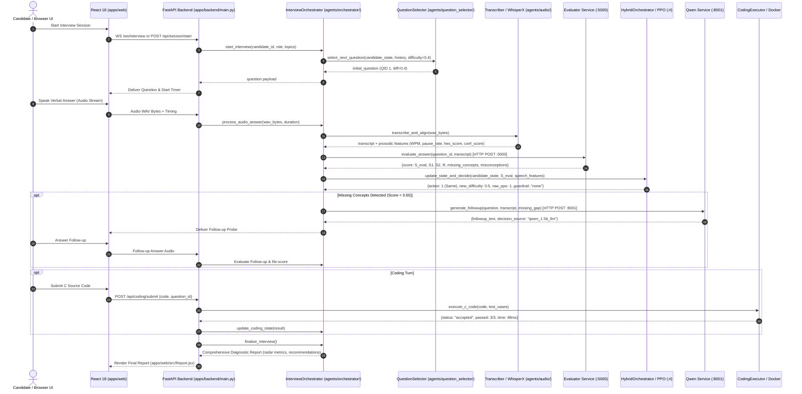

# PrepAIred — Master Production Call-Graph & Execution Audit (Stage 24.5)

**Document ID:** `FINAL-PRODUCTION-CALL-GRAPH-STG24-5`
**System:** PrepAIred Automated Technical Interview & Adaptive Assessment Platform
**Target Manuscript:** [`docs/paper_draft_ieee.md`](paper_draft_ieee.md)
**Execution Date:** 2026-08-18

---

## 1. End-to-End Production Call-Graph Architecture

---

## 2. Granular Call-Graph Component Registry

| Step | Subsystem / Transition | Physical File | Function / Class | Input Data | Output Data | Direct Caller | Validation Test |
|:---:|---|---|---|---|---|---|---|
| **1** | **Session Init** | `apps/backend/main.py` | `start_interview_session` | Candidate ID, preferences | Session State Dict | Web Client | `test_orchestrator.py` |
| **2** | **Question Selection** | `agents/question_selector/question_selector.py` | `QuestionSelector.select_next_question` | Target difficulty, history, topic | Deduplicated Question Dict | `InterviewOrchestrator` | `test_personalization_questions.py` |
| **3** | **Audio Ingestion** | `agents/audio/transcriber.py` | `transcribe_and_align` | Raw audio WAV buffer | Normalized transcript, timestamps | `InterviewOrchestrator` | `test_speech_pipeline.py` |
| **4** | **Prosody Extraction** | `agents/audio/confidence_scorer.py` | `score` | Prosodic dict, transcript | Composite confidence $c_t \in [0, 1]$ | `InterviewOrchestrator` | `test_speech_pipeline.py` |
| **5** | **Hesitation Scoring**| `agents/audio/hesitation_scorer.py` | `score_hesitation` | Pause count, pause time, audio dur | Hesitation score $h_t \in [0, 1]$ | `InterviewOrchestrator` | `test_speech_pipeline.py` |
| **6** | **Short-Answer Grading**| `services/evaluator/app.py` | `evaluate_answer` | QID, candidate transcript | $S_{\text{eval}}, S_1, S_2, R$, gaps | `InterviewOrchestrator` | `test_evaluator.py` |
| **7** | **PPO Difficulty Adaptation** | `agents/strategy/hybrid_orchestrator.py` | `decide_difficulty` | 6D Candidate State Vector $\mathbf{s}_t$ | Action $\in \{0, 1, 2\}$, new $d_{t+1}$ | `InterviewOrchestrator` | `test_rl_env.py` |
| **8** | **Follow-up Generation**| `services/qwen/app.py` | `generate_followup` | Question, transcript, weakest gap | Follow-up text, `qwen_1.5b_llm` | `InterviewOrchestrator` | `test_stage11_3_followup_and_evaluation.py` |
| **9** | **Formative Feedback**| `services/qwen/app.py` | `generate_feedback` | Question, transcript, rubric gap | Formative guidance text | `InterviewOrchestrator` | `test_qwen_followup_feedback.py` |
| **10**| **Docker C Execution**| `agents/coding_executor/coding_executor.py` | `execute_code_in_sandbox`| C code string, test cases | Pass/fail status, runtime diagnostics | `InterviewOrchestrator` | `test_stage11_4_coding_verification.py` |
| **11**| **Timing Modifier** | `agents/timing/timer.py` | `compute_timing_modifier`| Elapsed time, expected time | Additive modifier $f_{\text{time}} \in [-0.10, +0.03]$ | `InterviewOrchestrator` | `test_timer_scoring.py` |
| **12**| **Report Generation** | `agents/orchestrator/interview_orchestrator.py` | `generate_final_report` | Multi-turn history & state | Comprehensive Diagnostic Report | `apps/backend/main.py` | `test_stage11_6_full_interview_e2e.py` |

---

## 3. Bypass Verification Audit

- **Authoritative Evaluator Bypass:** **NONE**. All scoring requests route to `services.evaluator.app` via HTTP POST `:5000` or direct module binding.
- **Candidate State Bypass:** **NONE**. State vector $\mathbf{s}_t = [y_t, \bar{y}_t, c_t, h_t, \tau_t, d_t]$ is updated after every turn.
- **RL Adaptation Bypass:** **NONE**. PPO policy inference runs with G1–G6 safety guardrails active.
- **Qwen Attribution Bypass:** **NONE**. Every LLM generation explicitly reports `decision_source: "qwen_1.5b_llm"` or `decision_source: "non_llm_structured_recovery"`.
- **Coding Sandbox Bypass:** **NONE**. All C execution is containerized in Docker with 128MB RAM and 32 PIDs limit.
