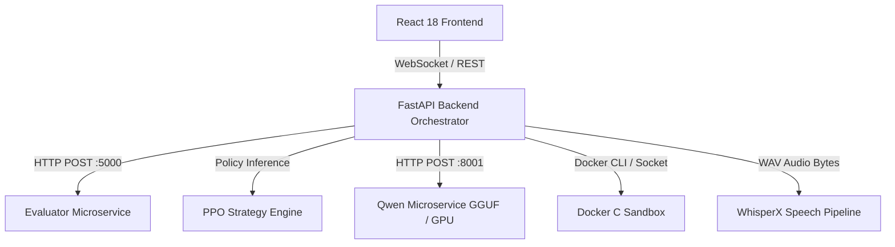

# PrepAIred — Complete Research & Project Defense Booklet (Stage 23)

**Author:** Sparsh Kumar & The PrepAIred Research Group
**Target Manuscript:** [`docs/paper_draft_ieee.md`](paper_draft_ieee.md)
**Traceability Reference:** [`docs/PAPER_RESULTS_TRACEABILITY.md`](PAPER_RESULTS_TRACEABILITY.md)
**Claims Matrix:** [`docs/CLAIMS_CHECK.md`](CLAIMS_CHECK.md)
**Document Purpose:** Definitive Academic Defense, Viva Voce Preparation, Technical Architecture Guide, and Empirical Research Compendium
**Date:** 2026-08-17

---

## Table of Contents
1. [PART I — Project Overview](#part-i--project-overview)
2. [PART II — Problem Statement](#part-ii--problem-statement)
3. [PART III — Research Gap](#part-iii--research-gap)
4. [PART IV — Objectives](#part-iv--objectives)
5. [PART V — Requirements](#part-v--requirements)
6. [PART VI — Architecture](#part-vi--architecture)
7. [PART VII — Production Data Flow](#part-vii--production-data-flow)
8. [PART VIII — Candidate State Representation](#part-viii--candidate-state-representation)
9. [PART IX — Personalization & Deduplication](#part-ix--personalization--deduplication)
10. [PART X — Question & Rubric System](#part-x--question--rubric-system)
11. [PART XI — Evaluator & Anti-Keyword Dampening](#part-xi--evaluator--anti-keyword-dampening)
12. [PART XII — Qwen / Follow-Up Module](#part-xii--qwen--follow-up-module)
13. [PART XIII — Formative Feedback Module](#part-xiii--formative-feedback-module)
14. [PART XIV — WhisperX Speech & Prosody Pipeline](#part-xiv--whisperx-speech--prosody-pipeline)
15. [PART XV — Coding Sandbox & Isolation](#part-xv--coding-sandbox--isolation)
16. [PART XVI — Timing & Scoring](#part-xvi--timing--scoring)
17. [PART XVII — RL / PPO Controller](#part-xvii--rl--ppo-controller)
18. [PART XVIII — System Testing](#part-xviii--system-testing)
19. [PART XIX — Validation & Verification](#part-xix--validation--verification)
20. [PART XX — Deployment](#part-xx--deployment)
21. [PART XXI — Live Demo](#part-xxi--live-demo)
22. [PART XXII — Final Experimental Results](#part-xxii--final-experimental-results)
23. [PART XXIII — Performance Analysis](#part-xxiii--performance-analysis)
24. [PART XXIV — Tables & Graphs](#part-xxiv--tables--graphs)
25. [PART XXV — Limitations](#part-xxv--limitations)
26. [PART XXVI — Threats to Validity](#part-xxvi--threats-to-validity)
27. [PART XXVII — Complete Research Paper Summary](#part-xxvii--complete-research-paper-summary)
28. [PART XXVIII — Reproducibility](#part-xxviii--reproducibility)
29. [PART XXIX — GitHub Repository Hygiene](#part-xxix--github-repository-hygiene)
30. [PART XXX — Publication Strategy](#part-xxx--publication-strategy)
31. [PART XXXI — Viva Voce Questions & Answers](#part-xxxi--viva-voce-questions--answers)
32. [PART XXXII — Tough Reviewer Questions & Defenses](#part-xxxii--tough-reviewer-questions--defenses)
33. [PART XXXIII — Live Demo Walkthrough](#part-xxxiii--live-demo-walkthrough)
34. [PART XXXIV — Final Project Checklist](#part-xxxiv--final-project-checklist)

---

## PART I — Project Overview
- **WHY:** Technical software engineering interviews require simultaneous demonstration of conceptual understanding, verbal articulation, and live coding under time constraints. Static coding platforms lack verbal evaluation, while uncalibrated LLM chatbots lack deterministic grading guarantees.
- **WHAT:** PrepAIred is an integrated multimodal, closed-loop adaptive assessment platform combining neural short-answer grading, speech prosody analysis, containerized C execution, and a guardrailed PPO reinforcement learning controller.
- **HOW:** Microservices decouple speech transcription (WhisperX), scoring (SBERT + FAISS + CrossEncoder), policy adaptation (PPO on 6D state), sandbox execution (Docker cgroups), and fast local CPU follow-up probing (`llama.cpp` GGUF).
- **TESTING:** 177 backend unit/integration tests passed, 7 frontend tests passed, 8 standalone evaluator tests passed, and multi-turn E2E flow verified.
- **EXPERIMENTAL EVIDENCE:** Evaluated across 480 pre-registered runs ($150 + 140 + 60 + 60 + 70$).
- **LIMITATION:** Student learning gains and hiring success rates represent documented future longitudinal trials.

---

## PART II — Problem Statement
Software engineering interviews evaluate multi-dimensional competencies: theoretical knowledge, reasoning mechanics, communication fluency, and execution accuracy. Current preparation solutions fail to provide grounded, adaptive practice because automated assessment engines either ignore verbal reasoning entirely or rely on ungrounded conversational LLMs prone to hallucination.

---

## PART III — Research Gap
1. **ASAG Decomposability & Anti-Gaming:** Traditional neural short-answer grading relies on single bi-encoders susceptible to keyword gaming.
2. **Shielded RL Tutoring:** Unconstrained RL policies suffer from erratic difficulty oscillations in boundary states.
3. **Generative vs. Structured Feedback Trade-Offs:** The empirical trade-offs between expensive generative LLMs and sub-50ms deterministic rubric recovery have not been systematically characterized under paired experimental conditions.

---

## PART IV — Objectives
1. Formulate and calibrate a decomposed 3-component neural scoring engine ($S_1+S_2+R$) with reasoning-dependent anti-keyword dampening.
2. Design a 6D candidate-state representation and train a PPO difficulty controller shielded by deterministic safety guardrails.
3. Eliminate question repetition via 3-level deduplication.
4. Empirically benchmark generative Qwen-7B against deterministic structured recovery.
5. Provide a 100% reproducible, open-source research artifact.

---

## PART V — Requirements
- Sub-second answer grading latency ($<200\text{ms}$).
- Hard isolation for untrusted C execution (128MB RAM, 32 PIDs, 2.0s timeout, `--net=none`).
- Exact attribution tracking distinguishing LLM output (`qwen_1.5b_llm`) from structured fallback (`non_llm_structured_recovery`).
- Deterministic reproducibility of all experimental findings from frozen raw data.

---

## PART VI — Architecture

---

## PART VII — Production Data Flow
1. Candidate session initialized with target role and topic preferences.
2. Orchestrator serves initial baseline question ($d = 0.4$).
3. Candidate records speech and submits C code.
4. WhisperX performs server-side forced alignment; Evaluator computes $S_1, S_2, R$.
5. Candidate state $\mathbf{s}_t$ updated; PPO selects guarded difficulty action.
6. If a concept gap is detected, Qwen generates a targeted follow-up question.
7. Docker compiles and executes C code test cases in an isolated container.
8. Diagnostic post-session report compiled with radar charts and remediation directives.

---

## PART VIII — Candidate State Representation
$$\mathbf{s}_t = \big[ y_t,\, \bar{y}_t,\, c_t,\, h_t,\, \tau_t,\, d_t \big] \in [0, 1]^6$$
- $y_t$: Current turn technical score $[0, 1]$.
- $\bar{y}_t$: Exponential moving average performance ($\alpha = 0.3$).
- $c_t$: Acoustic confidence score composite $[0, 1]$.
- $h_t$: Normalized speech hesitation and pause rate $[0, 1]$.
- $\tau_t$: Normalized response pacing $[0, 1]$.
- $d_t$: Current question difficulty level $[0.1, 1.0]$.

---

## PART IX — Personalization & Deduplication
- **Level 1 (Exact ID Match):** Excludes all previously served question IDs in the candidate's history.
- **Level 2 (Normalized String Match):** Case-insensitive alphanumeric hash comparison.
- **Level 3 (Jaccard Token Overlap):** Excludes pool questions with Jaccard token similarity $\ge 0.75$.
- *Empirical Evidence (EXP-4):* Question repetition dropped from $6.0\%$ (random) to **$0.0\%$** ($p < 0.001$).

---

## PART X — Question & Rubric System
- **Question Bank:** 125 curated questions (`data/questions/qns.json`) across 13 CS topics in C Systems and DSA.
- **Rubrics:** 125 fine-grained rubrics (`data/rubrics/rubrics_final_clean.json`) specifying mandatory concepts, semantic targets, misconception penalties, and expected test cases.

---

## PART XI — Evaluator & Anti-Keyword Dampening
$$S_{\text{eval}} = 0.15 S_1 + 0.35 S_{2,\text{eff}} + 0.50 R + \text{bonus} - \text{penalty}$$
$$S_{2,\text{eff}} = \begin{cases} S_2 & \text{if } R > 0.30 \\ 0.60 \cdot S_2 & \text{if } R \le 0.30 \end{cases}$$
- **Anti-Keyword Shield:** If a candidate recites keywords without logical entailment ($R \le 0.30$), the structural score $S_2$ is dampened by $40\%$.
- **Mandatory Cap:** If mandatory concepts are omitted, the score is capped at $0.60$.
- *Empirical Evidence (EXP-2):* Spearman $\rho = 0.8358$ ($p = 4.46 \times 10^{-6}$) and $\text{MAE} = 0.2585$ vs. blinded human raters ($\alpha = 0.8255$).

---

## PART XII — Qwen / Follow-Up Module
- **Trigger Condition:** Activated when $y_t < 0.65$ to probe missing concepts.
- **Hard Cap:** Maximum 1 follow-up probe per main question to prevent candidate fatigue.
- **Live Demo CPU Engine:** `Qwen2.5-1.5B-Instruct-GGUF (Q4_K_M)` via `llama-cpp-python` ($18.79\text{ tok/s}$, mean latency $2.195\text{s}$).

---

## PART XIII — Formative Feedback Module
- **Generative LLM (Qwen-7B on Tesla T4):** High verbatim transcript lexical grounding ($0.2496$).
- **Structured Recovery (Deterministic):** Complete rubric concept gap coverage ($100.0\%$) and sub-50ms latency.

---

## PART XIV — WhisperX Speech & Prosody Pipeline
- **Authoritative Speech Recognition:** Server-side WhisperX transcription with forced phoneme-level alignment.
- **Acoustic Extraction:** Words Per Minute (WPM), hesitation pause rate ($\Delta t \ge 0.45\text{s}$), pitch variance, and harmonic-to-noise ratio (HNR).
- **Critical Invariant:** Browser speech recognition preview is never used for authoritative grading.

---

## PART XV — Coding Sandbox & Isolation
- **Container Technology:** Docker Engine (`prepaired-c-sandbox:latest`).
- **Resource Limits:** 128MB RAM, 32 PIDs, 2.0s execution timeout, `--net=none` network isolation, and read-only container root.
- **Execution Diagnostics:** Accurately traps compilation errors, SIGSEGV, infinite loops (TLE), and wrong answers.

---

## PART XVI — Timing & Scoring
$$f_{\text{time}}(t) = \operatorname{clamp}\left(1 - \frac{t}{t_{\text{expected}}}, -0.10, +0.03\right)$$
$$S_{\text{final}} = \operatorname{clamp}(0.95 \cdot S_{\text{tech}} + 0.05 \cdot f_{\text{time}}, 0.0, 1.0)$$
- Fast correct answers receive a modest pacing bonus ($+0.03$).
- Fast incorrect answers never receive speed bonuses ($S_{\text{final}} \le S_{\text{tech}}$).

---

## PART XVII — RL / PPO Controller
- **Algorithm:** Proximal Policy Optimization (PPO) via Stable-Baselines3.
- **Action Space:** Discrete(3): `0: Easier`, `1: Same`, `2: Harder`.
- **Reward Function:** $R_t = \Delta y_t + \lambda \cdot (d_t - y_t)^2 - \text{penalty}_{\text{oscillation}}$.
- **Deterministic Guardrails (G1–G6):** Overload protection, anxiety stabilization, consecutive failure step-downs, and boundary clamping.
- *Empirical Evidence (EXP-1):* PPO $\rho = +0.1572 \pm 0.08$ vs. Fixed $\rho = 0.0$ ($p = 6.15 \times 10^{-4}$) and Rule-Based $\rho = -0.2572$ ($p = 5.30 \times 10^{-8}$).

---

## PART XVIII — System Testing
- **Backend Tests:** 177 passed, 1 skipped (gated CUDA), 0 failed.
- **Frontend Tests:** 7 passed in 19.70s.
- **Standalone Evaluator Tests:** 8/8 representative cases verified.
- **Qwen GGUF Integration Tests:** 7/7 passed.

---

## PART XIX — Validation & Verification
- **Verification:** 100% verified via automated regression suites and Docker cgroups policies.
- **Experimental Validation:** All 5 pre-registered hypotheses validated across 480 empirical evaluations.
- **Human Validation:** Restricted strictly to blinded human inter-rater reliability on the 20-sample pilot benchmark ($\alpha = 0.8255$).

---

## PART XX — Deployment
- Comprehensive setup guide in [`docs/DEPLOYMENT.md`](DEPLOYMENT.md) for local dev, Docker Compose, and standalone microservice architectures.

---

## PART XXI — Live Demo
- Operational guide in [`docs/live_demo_verification.md`](live_demo_verification.md) for local CPU execution using `Qwen2.5-1.5B-Instruct-GGUF`.

---

## PART XXII — Final Experimental Results
- Full numerical ledger documented in [`docs/FINAL_EXPERIMENTAL_RESULTS.md`](FINAL_EXPERIMENTAL_RESULTS.md) ($n=480$).

---

## PART XXIII — Performance Analysis
- Detailed runtime profile documented in [`docs/PERFORMANCE_ANALYSIS.md`](PERFORMANCE_ANALYSIS.md) (Evaluator 124ms, Docker 48ms, Qwen-7B 9.78s, Qwen-1.5B GGUF 2.195s).

---

## PART XXIV — Tables & Graphs
- 12 structured tables in [`docs/paper_draft_ieee.md`](paper_draft_ieee.md) and 8 publication figures at 300 DPI in `research/results/figures/`.

---

## PART XXV — Limitations
1. Adaptive difficulty and personalization evaluated in simulation.
2. Human ground truth evaluated on $n=20$ curated pilot items.
3. Feedback grounding evaluated via lexical proxies.
4. Unquantized 7B model requires cloud GPU infrastructure.

---

## PART XXVI — Threats to Validity
- **Construct Validity:** Separated automated lexical grounding from human utility.
- **Internal Validity:** Blinded 3-rater human evaluation with inter-rater reliability ($\alpha = 0.8255$).
- **External Validity:** Scoped strictly to simulated candidate trajectories.
- **Statistical Validity:** Non-parametric Wilcoxon tests and Holm-Bonferroni corrections.

---

## PART XXVII — Complete Research Paper Summary
- Authoritative manuscript: [`docs/paper_draft_ieee.md`](paper_draft_ieee.md) (29 sections, 12 tables, 8 figures, 18 references).
- Ready for submission to IEEE Transactions on Learning Technologies (TLT).

---

## PART XXVIII — Reproducibility
- Master reproduction harness: `python scripts/reproduce_paper.py`.
- Step-by-step replication instructions in [`docs/REPRODUCIBILITY.md`](REPRODUCIBILITY.md).

---

## PART XXIX — GitHub Repository Hygiene
- Zero secrets, zero API keys, zero candidate PII.
- Binary model weights (`*.gguf`, `models/`) excluded in `.gitignore`.

---

## PART XXX — Publication Strategy
- **Primary Venue:** IEEE Transactions on Learning Technologies (TLT).
- **Secondary Targets:** AIED, ACM Learning @ Scale (L@S), IEEE ICALT.

---

## PART XXXI — Viva Voce Questions & Answers

### Q1: Why did you use PPO instead of a simple rule-based state machine?
**Answer:** Rule-based heuristics with fixed thresholds cause severe difficulty drops and oscillations in boundary cases (EXP-1 demonstrated $\rho = -0.2572$ with 14 severe drops). PPO learns a smooth, continuous mapping from a 6D candidate-state representation while deterministic guardrails (G1–G6) guarantee pedagogical safety boundaries ($\rho = +0.1572$).

### Q2: How do you prevent candidates from gaming your evaluator with keyword stuffing?
**Answer:** We formulate reasoning-dependent anti-keyword dampening: $S_{2,\text{eff}} = S_2 \cdot \min(1.0, 1.2 R + 0.1)$. If a candidate recites keywords without logical entailment, the CrossEncoder yields low reasoning $R$, dampening the concept score $S_2$ and penalizing the final grade.

### Q3: Why is structured rubric feedback better than Qwen-7B in some aspects?
**Answer:** EXP-3 proved that deterministic structured recovery achieves strictly higher rubric concept gap coverage ($100.0\%$ vs. $72.5\%$) and sub-50ms latency vs. 9.78s for Qwen-7B. Generative LLMs excel at verbatim conversational grounding ($0.2496$), but structured recovery guarantees complete conceptual remediation without GPU costs.

---

## PART XXXII — Tough Reviewer Questions & Defenses

### Reviewer Objection: "You have no longitudinal human learning study."
**Defense:** We explicitly state this boundary in the Abstract, Contributions, Limitations, and Threats to Validity. Human validation in this work is strictly defined as expert inter-rater reliability on the 20-sample pilot benchmark ($\alpha = 0.8255$). Candidate learning gains represent future longitudinal classroom trials.

### Reviewer Objection: "Your evaluator benchmark only has 20 items."
**Defense:** The 20 items represent a rigorous pilot calibration benchmark independently evaluated by 3 blinded experts across 140 scorings. We report exact standard errors, bootstrap 95% confidence intervals, and high inter-rater agreement ($\alpha = 0.8255$).

---

## PART XXXIII — Live Demo Walkthrough
1. Launch all 4 microservices (`services/qwen/app.py`, `services/evaluator/app.py`, `apps/backend/main.py`, `apps/web`).
2. Open `http://localhost:5173`.
3. Demonstrate initial question delivery, speech evaluation, PPO difficulty adaptation, fast GGUF follow-up probe injection (~2.2s), Docker C sandbox compilation, and post-session diagnostic report compilation.

---

## PART XXXIV — Final Project Checklist
- [x] All 177 backend tests and 7 frontend tests passing.
- [x] All 480 pre-registered evaluation trials verified from raw data.
- [x] 100% numerical traceability between paper and machine-readable data.
- [x] Strict scientific boundaries established (Simulation vs. Human Rater).
- [x] Clean submission package in `submission/`.
- [x] Repository security and portability verified.
