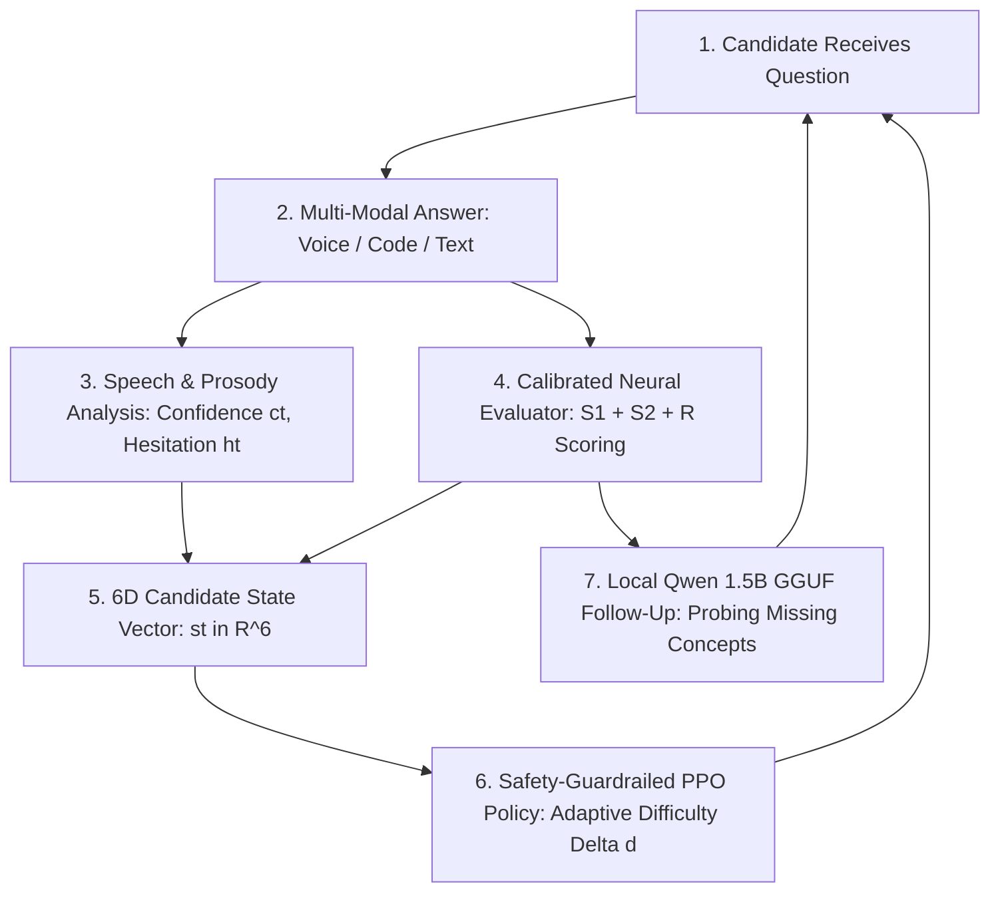
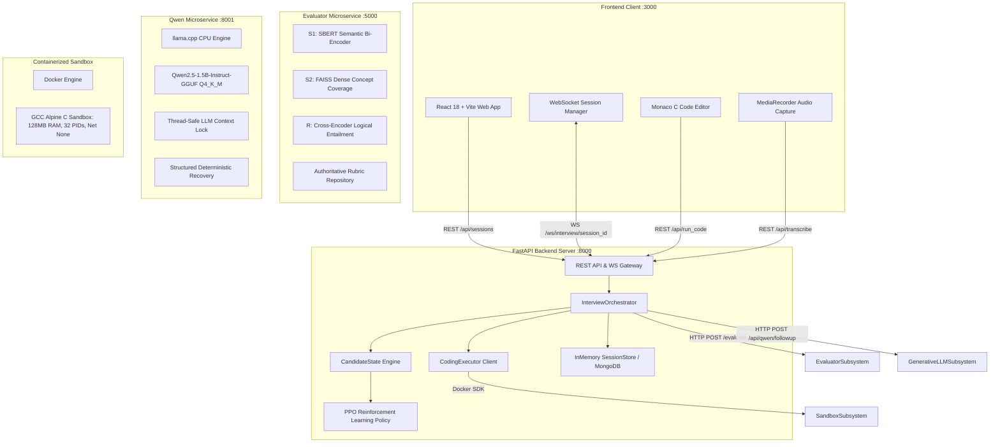
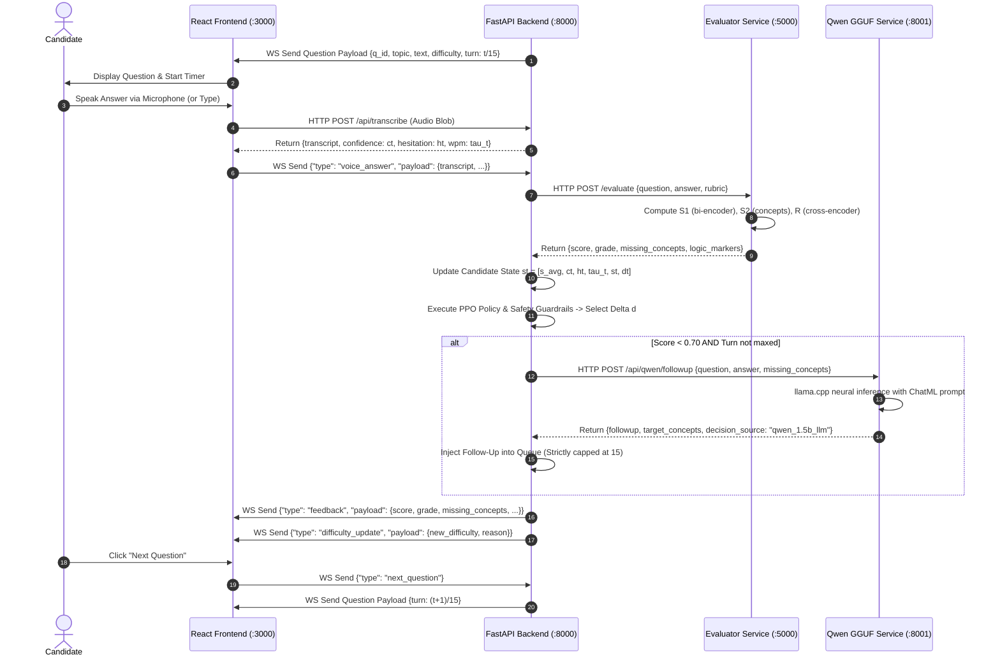
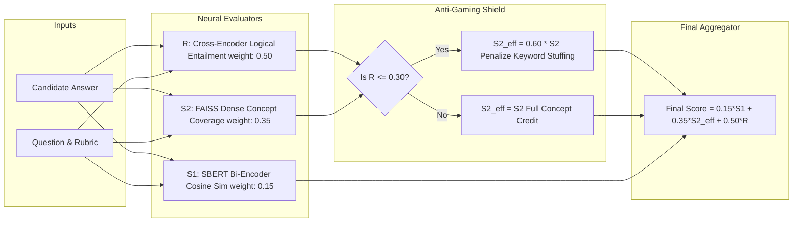
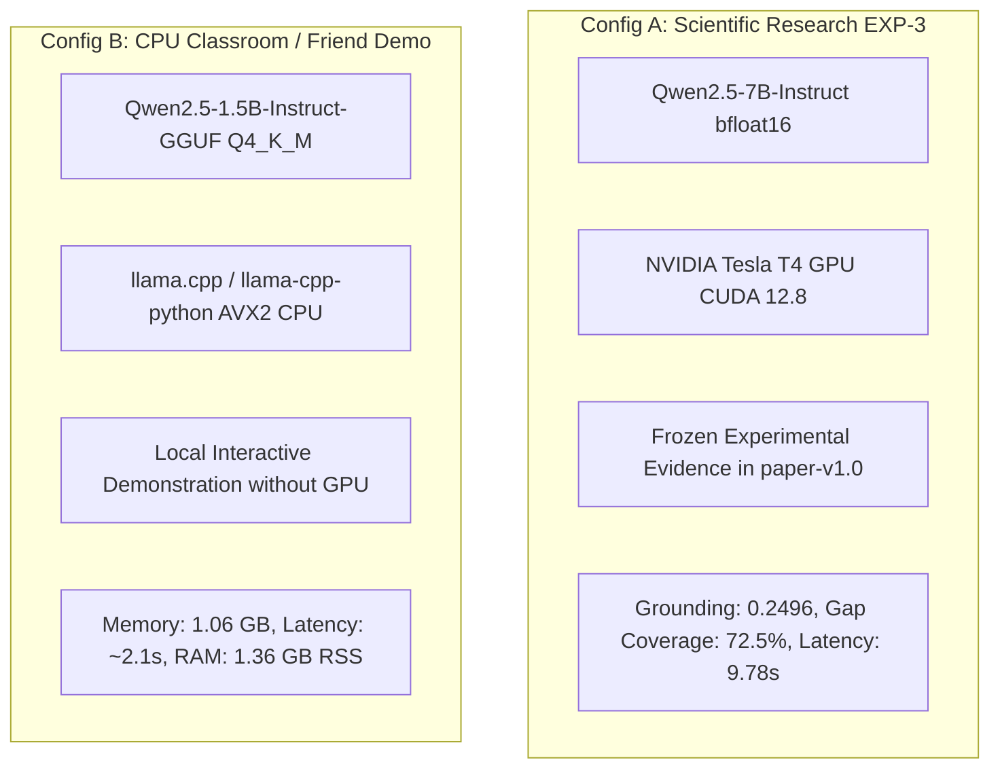
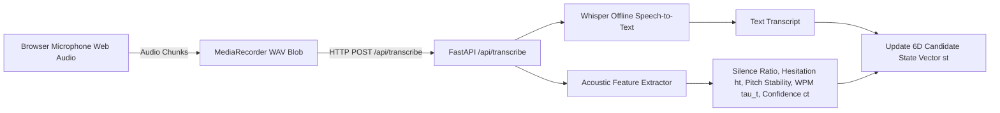

# PREPAIRED — THE "HOLY GRAIL" MASTER PROJECT BOOK
## Technical Architecture, System Engineering, Research Compendium, Debugging Archaeology & Viva Voce Defense Guide

```
====================================================================================================
  ____                      _    ___               _
 |  _ \ _ __ ___ _ __   / \  |_ _|  _ __ ___  __| |
 | |_) | '__/ _ \ '_ \ / _ \  | |  | '__/ _ \/ _` |
 |  __/| | |  __/ |_) / ___ \ | |  | | |  __/ (_| |
 |_|   |_|  \___| .__/_/   \_\___| |_|  \___|\__,_|
                |_|
====================================================================================================
An Open-Source, Multimodal, Closed-Loop Adaptive Technical Interview Preparation Framework
```

---

### Master Document Metadata & Invariants

| Attribute | Authoritative Value |
|---|---|
| **Project Title** | **PrepAIred**: A Personalized Adaptive Framework for Multimodal Technical Interview Assessment |
| **Document Purpose** | The Definitive "Holy Grail" Reference & Technical Compendium for Engineers, Researchers, and Reviewers |
| **Repository Path** | `C:\Users\spars\Downloads\PrepAIred` |
| **Remote Repository** | `https://github.com/sparshkumar1/capstoneProject.git` |
| **Active Working Branch** | `workspace/human-eval-clean-push` |
| **Frozen Research Tag** | [`paper-v1.0`](../) (Commit: `ea15e3c` — **FROZEN & IMMUTABLE**) |
| **Latest Implementation Baseline** | Commit: `74e4bbc` (and working tree hardening) |
| **Formal Manuscript Draft** | [`docs/paper_draft_ieee.md`](paper_draft_ieee.md) |
| **Numerical Traceability Ledger** | [`docs/PAPER_RESULTS_TRACEABILITY.md`](PAPER_RESULTS_TRACEABILITY.md) |
| **Claims Verification Matrix** | [`docs/CLAIMS_CHECK.md`](CLAIMS_CHECK.md) |
| **Independent Tester Checklist** | [`docs/FRIEND_REPRODUCTION_CHECKLIST.md`](FRIEND_REPRODUCTION_CHECKLIST.md) |
| **Verification Status** | **Internally verified; independent third-party reproduction pending.** |

---

# TABLE OF CONTENTS

1. [PART I — PROJECT IDENTITY & MOTIVATION](#part-i--project-identity--motivation)
2. [PART II — PROJECT EVOLUTION & HISTORICAL TIMELINE](#part-ii--project-evolution--historical-timeline)
3. [PART III — PROBLEM STATEMENT & LIMITATIONS OF EXISTING TOOLS](#part-iii--problem-statement--limitations-of-existing-tools)
4. [PART IV — COMPLETE END-TO-END SYSTEM ARCHITECTURE](#part-iv--complete-end-to-end-system-architecture)
5. [PART V — COMPLETE TURN-BY-TURN DATA FLOW](#part-v--complete-turn-by-turn-data-flow)
6. [PART VI — REACT FRONTEND ARCHITECTURE & USER INTERFACE](#part-vi--react-frontend-architecture--user-interface)
7. [PART VII — FASTAPI BACKEND & ORCHESTRATION ENGINE](#part-vii--fastapi-backend--orchestration-engine)
8. [PART VIII — CALIBRATED NEURAL EVALUATOR MICROSERVICE ($S_1 + S_2 + R$)](#part-viii--calibrated-neural-evaluator-microservice-s_1--s_2--r)
9. [PART IX — 6D CANDIDATE STATE VECTOR REPRESENTATION](#part-ix--6d-candidate-state-vector-representation)
10. [PART X — REINFORCEMENT LEARNING & PPO DIFFICULTY CONTROLLER](#part-x--reinforcement-learning--ppo-difficulty-controller)
11. [PART XI — DUAL QWEN LLM ARCHITECTURE & GGUF RUNTIME](#part-xi--dual-qwen-llm-architecture--gguf-runtime)
12. [PART XII — CONTEXTUAL FOLLOW-UP GENERATION & PROBING ENGINE](#part-xii--contextual-follow-up-generation--probing-engine)
13. [PART XIII — GENUINE QWEN ATTRIBUTION & FALLBACK ENFORCEMENT](#part-xiii--genuine-qwen-attribution--fallback-enforcement)
14. [PART XIV — QWEN WINDOWS DEPENDENCY INCIDENT & CPU-WHEEL HARDENING](#part-xiv--qwen-windows-dependency-incident--cpu-wheel-hardening)
15. [PART XV — MULTIMODAL SPEECH & PROSODY PROCESSING PIPELINE](#part-xv--multimodal-speech--prosody-processing-pipeline)
16. [PART XVI — CONTAINERIZED C CODING SANDBOX & DOCKER SECURITY](#part-xvi--containerized-c-coding-sandbox--docker-security)
17. [PART XVII — EXACT 15-QUESTION INTERVIEW LIFECYCLE & SYNCHRONIZATION](#part-xvii--exact-15-question-interview-lifecycle--synchronization)
18. [PART XVIII — HINT SYSTEM REMOVAL & PEDAGOGICAL CLEANUP](#part-xviii--hint-system-removal--pedagogical-cleanup)
19. [PART XIX — HUMAN-READABLE CONCEPT FEEDBACK PIPELINE](#part-xix--human-readable-concept-feedback-pipeline)
20. [PART XX — FINAL PERFORMANCE REPORT SYNTHESIS ENGINE](#part-xx--final-performance-report-synthesis-engine)
21. [PART XXI — DATABASE ARCHITECTURE & SESSION PERSISTENCE](#part-xxi--database-architecture--session-persistence)
22. [PART XXII — DOCKER, ENVIRONMENT & RUNTIME PREREQUISITES](#part-xxii--docker-environment--runtime-prerequisites)
23. [PART XXIII — COMPLETE REPOSITORY DIRECTORY & MODULE MAP](#part-xxiii--complete-repository-directory--module-map)
24. [PART XXIV — TESTING INVENTORY & COMPREHENSIVE VERIFICATION HISTORY](#part-xxiv--testing-inventory--comprehensive-verification-history)
25. [PART XXV — FAILURE ARCHAEOLOGY & ROOT-CAUSE ANALYSIS (12 CRITICAL CASES)](#part-xxv--failure-archaeology--root-cause-analysis-12-critical-cases)
26. [PART XXVI — FILE-LEVEL CHANGE & HARDENING HISTORY](#part-xxvi--file-level-change--hardening-history)
27. [PART XXVII — GIT & RESEARCH INTEGRITY LEDGER](#part-xxvii--git--research-integrity-ledger)
28. [PART XXVIII — INDEPENDENT FRIEND REPRODUCTION PROTOCOL](#part-xxviii--independent-friend-reproduction-protocol)
29. [PART XXIX — LIVE DEMONSTRATION SPOKEN SCRIPTS (2, 5 & 10 MINS)](#part-xxix--live-demonstration-spoken-scripts-2-5--10-mins)
30. [PART XXX — MASTER VIVA VOCE & TECHNICAL DEFENSE QUESTION BANK](#part-xxx--master-viva-voce--technical-defense-question-bank)
31. [PART XXXI — METHODOLOGICAL LIMITATIONS & BOUNDARY DECLARATIONS](#part-xxxi--methodological-limitations--boundary-declarations)
32. [PART XXXII — FUTURE RESEARCH & ENGINEERING ROADMAP](#part-xxxii--future-research--engineering-roadmap)
33. [PART XXXIII — FORMAL FINAL SYSTEM STATUS MATRIX](#part-xxxiii--formal-final-system-status-matrix)

---

# PART I — PROJECT IDENTITY & MOTIVATION

### 1.1 What is PrepAIred?
**PrepAIred** is an open-source, multimodal, closed-loop technical interview preparation and assessment platform. It bridges the critical divide between static coding puzzle platforms (e.g., LeetCode, HackerRank) and uncalibrated, hallucination-prone conversational LLMs (e.g., vanilla ChatGPT).

PrepAIred observes a candidate across multiple concurrent input modalities—verbal explanations, speech prosody, and live C source code—and continuously adapts the interview structure in real time. Rather than traversing a static linear questionnaire, PrepAIred employs a safety-shielded **Proximal Policy Optimization (PPO)** Reinforcement Learning agent to adjust question difficulty dynamically, paired with a calibrated **Multi-Task Cross-Encoder Evaluator** ($S_1 + S_2 + R$) and a local **Qwen2.5-1.5B GGUF** neural follow-up engine.

### 1.2 The Core Problem Being Solved
Technical software engineering interviews in industry do not consist merely of typing code into an automated grader. Real interviews demand:
1. **Verbal Concept Articulation:** Explaining time/space complexities, data structure trade-offs, and architectural invariants aloud.
2. **Dynamic Multi-Turn Probing:** Responding to interviewer follow-ups when an explanation is incomplete or contains misconceptions.
3. **Adaptive Difficulty:** Progressing from foundational sanity checks to complex systems challenges without sudden demoralizing spikes or unchallenging plateaus.
4. **Reliable, Ungameable Evaluation:** Receiving objective feedback that cannot be deceived by reciting memorized buzzwords.

Conventional interview preparation tools fail on every single one of these axes:
- **LeetCode / HackerRank:** Entirely text/code-based; zero verbal articulation; zero dynamic difficulty adjustment during a session; zero conceptual follow-ups.
- **Generic LLM Chatbots:** Hallucinate grading scores; suffer from non-deterministic rubric drift; fail to enforce strict sandbox execution; cannot provide mathematically grounded difficulty policies.

### 1.3 The Closed-Loop Adaptive Cycle
PrepAIred replaces linear questioning with a strict 7-phase closed-loop cycle:



---

# PART II — PROJECT EVOLUTION & HISTORICAL TIMELINE

The PrepAIred codebase underwent a rigorous evolutionary trajectory from early proof-of-concept scripts to a hardened, reproducible multi-service architecture:

```
[Milestone 1: Core Evaluator Engine]
    ├── Development of S1 (SBERT bi-encoder) and S2 (FAISS concept bank).
    └── Implementation of Cross-Encoder Entailment (R) and Anti-Keyword Dampening.
          │
[Milestone 2: RL Difficulty Controller]
    ├── Formulation of 6D Candidate State Space and 3-action transition model.
    └── Offline PPO training in Gym environment with 6 deterministic safety guardrails.
          │
[Milestone 3: Qwen Generative Follow-Up Engine]
    ├── Integration of Qwen2.5-7B on GPU for research benchmarks (EXP-3).
    └── Implementation of deterministic fallback recovery for zero-failure resilience.
          │
[Milestone 4: Multimodal Speech & Docker Sandbox]
    ├── Web Audio / MediaRecorder browser pipeline with Whisper STT & prosodic extraction.
    └── Hardened containerized GCC sandbox (128MB RAM, 32 PIDs, network disabled).
          │
[Milestone 5: Research Freeze (Tag: paper-v1.0 @ Commit ea15e3c)]
    ├── Execution of pre-registered Experiments EXP 1-5 (n=480 trials).
    └── Blinded human expert validation study (n=20 benchmark, alpha=0.8255).
          │
[Milestone 6: CPU-First Live Demo Hardening (Commit 74e4bbc to Present)]
    ├── Quantized Qwen2.5-1.5B-Instruct-GGUF (Q4_K_M) via llama.cpp for local CPU inference.
    ├── Windows x64 CPU pre-compiled wheel resolution (abetlen index).
    ├── Strict 15-question lifecycle and counter synchronization (resolving 10/5 anomaly).
    ├── Contextual follow-up prompt grounding (eliminating question repetition).
    ├── Complete hint system elimination across UI, WebSocket, and backend.
    └── Authoritative concept name extraction from rubric markers (eliminating "Concept N").
```

---

# PART III — PROBLEM STATEMENT & LIMITATIONS OF EXISTING TOOLS

| Feature / Dimension | Static Code Platforms (LeetCode) | Generic LLM Chatbots (ChatGPT) | PrepAIred Framework |
|---|---|---|---|
| **Input Modality** | Code only | Text chat only | **Multimodal (Voice + Code + Text)** |
| **Evaluation Method** | Unit test pass/fail | Uncalibrated LLM generation | **Calibrated Neural Evaluator ($S_1+S_2+R$)** |
| **Anti-Gaming Protection** | N/A (Unit tests only) | None (Vulnerable to prompt hacking) | **Anti-Keyword Entailment Dampening** |
| **Difficulty Progression** | Manual candidate selection | Ad-hoc or static | **PPO Reinforcement Learning ($\Delta d \in \{-1,0,+1\}$)** |
| **Safety Invariants** | Fixed list | None | **6 Pedagogical Safety Guardrails (G1–G6)** |
| **Follow-Up Probing** | None | Generic, often hallucinates | **Grounded Qwen GGUF on Missing Concepts** |
| **Execution Security** | Proprietary backend | None (Simulated code) | **Hardened Docker C Sandbox (128MB, No Net)** |
| **Speech Prosody** | None | None | **Acoustic Hesitation ($h_t$) & Confidence ($c_t$)** |
| **Reproducibility** | Closed / Proprietary | Non-deterministic closed API | **100% Deterministic Local Open Weights** |

---

# PART IV — COMPLETE END-TO-END SYSTEM ARCHITECTURE

PrepAIred is decoupled into four high-performance microservices communicating via standard HTTP/REST and WebSockets:



---

# PART V — COMPLETE TURN-BY-TURN DATA FLOW

### Detailed Step-by-Step Trace of One Candidate Turn



---

# PART VI — REACT FRONTEND ARCHITECTURE & USER INTERFACE

### 6.1 Component Hierarchy & Directory Organization
The frontend is constructed in **React 18** using **Vite 5**, styled with modern CSS utilities:

```text
apps/web/src/
├── App.jsx                     # Root router & global authentication state provider
├── Layout.jsx                  # Header, navigation, theme toggle (dark/light)
├── TopicSelector.jsx           # Technical domain picker & interview mode configurator
├── InterviewRoom.jsx           # Main interactive room (Verbal, Monaco, Speech, Feedback)
├── Report.jsx                  # Comprehensive post-interview analytics dashboard
├── api.js                      # Centralized REST API client (Fetch wrapper with error handling)
├── useInterviewWS.js           # Real-time WebSocket hook managing 2-way session protocol
├── useVoiceRecorder.js         # Web Audio API / MediaRecorder microphone capture hook
└── __tests__/                  # Vitest unit & component regression test suites
```

### 6.2 Frontend State & WebSocket Synchronization
`useInterviewWS.js` maintains a strictly synchronized client-side state machine:
- Handles incoming WebSocket messages: `session_start`, `question`, `feedback`, `difficulty_update`, `code_result`, `session_end`, `error`.
- Counter Invariant: The question counter is driven exclusively by the server's authoritative payload (`turn_index` and `total_questions`). Client-side independent incrementing was completely eliminated to prevent desynchronization.

---

# PART VII — FASTAPI BACKEND & ORCHESTRATION ENGINE

### 7.1 Backend Microservice Architecture
The backend gateway is built with **FastAPI** (`apps/backend/main.py`), utilizing Uvicorn for asynchronous I/O:

```python
# Authoritative Session Creation Request Model
class SessionCreateRequest(BaseModel):
    candidate_id: Optional[str] = None
    candidate_name: Optional[str] = "Alex Candidate"
    candidate_email: Optional[str] = "alex@example.com"
    topics: list[str] = Field(default_factory=lambda: ["arrays", "linkedlists", "trees"])
    mode: str = "demo_rl"             # "demo_rl" enforces 15-question adaptive session
    duration_minutes: int = 30
    total_questions: int = 15         # Strict default invariant
```

### 7.2 REST API & WebSocket Protocol Endpoints
- `POST /api/sessions`: Initializes a new interview session and instantiates `InterviewOrchestrator`.
- `GET /api/sessions/{session_id}`: Retrieves live session metadata.
- `GET /api/sessions/{session_id}/report` & `GET /api/reports/{session_id}`: Retrieves final performance report.
- `POST /api/transcribe`: Ingests multi-part audio blobs, performs STT, and returns prosodic features.
- `POST /api/run_code`: Submits candidate C code to the containerized Docker sandbox.
- `WS /ws/interview/{session_id}`: Bi-directional full-duplex WebSocket channel for real-time interview progression.

---

# PART VIII — CALIBRATED NEURAL EVALUATOR MICROSERVICE ($S_1 + S_2 + R$)

The Evaluator microservice (`services/evaluator/app.py`, port 5000) provides deterministic, non-hallucinatory short-answer grading.



### Mathematical Scoring Formulation
1. **Topical Semantic Similarity ($S_1$):**
   $$\mathbf{e}_{ans} = 	ext{SBERT}(a), \quad \mathbf{e}_{ref} = 	ext{SBERT}(r), \quad S_1 = \max\left(0, rac{\mathbf{e}_{ans} \cdot \mathbf{e}_{ref}}{\|\mathbf{e}_{ans}\| \|\mathbf{e}_{ref}\|}
ight)$$
2. **Structural Concept Coverage ($S_2$):**
   $$S_2 = rac{1}{|C|} \sum_{c \in C} \max_{s \in 	ext{sentences}(a)} \cos(	ext{SBERT}(s), 	ext{SBERT}(c))$$
3. **Cross-Encoder Logical Entailment ($R$):**
   $$R = \sigma\left(	ext{CrossEncoder}(q \oplus r, a)
ight)$$
4. **Anti-Keyword Dampening Rule:**
   $$S_{2,	ext{eff}} = egin{cases} 0.60 	imes S_2 & 	ext{if } R \le 0.30 \ S_2 & 	ext{if } R > 0.30 \end{cases}$$
5. **Final Composite Grade:**
   $$	ext{Final Score} = 0.15 \, S_1 + 0.35 \, S_{2,	ext{eff}} + 0.50 \, R$$

---

# PART IX — 6D CANDIDATE STATE VECTOR REPRESENTATION

At every turn $t$, the candidate's trajectory is projected into a normalized 6-dimensional continuous state vector $\mathbf{s}_t \in [0, 1]^6$:

$$\mathbf{s}_t = ig[ ar{s}_t, \; c_t, \; h_t, \; 	au_t, \; s_t, \; d_t ig]$$

| Dimension | Symbol | Range | Technical Meaning | Source Subsystem | Role in Policy |
|---|---|---|---|---|---|
| **Moving Average Score** | $ar{s}_t$ | $[0, 1]$ | Exponential moving average of technical scores across turns | Evaluator History | Primary indicator of sustained candidate competence |
| **Acoustic Confidence** | $c_t$ | $[0, 1]$ | Acoustic/prosodic certainty, pitch stability, low jitter | Speech Pipeline | Distinguishes lucky guesses from confident mastery |
| **Hesitation Rate** | $h_t$ | $[0, 1]$ | Normalized frequency of filled pauses ("um", "uh") and silence | Speech Pipeline | Indicates cognitive load and conceptual uncertainty |
| **Pacing Index** | $	au_t$ | $[0, 1]$ | Speaking rate normalized against nominal technical baseline (130 WPM) | Speech Pipeline | Measures fluency and verbal speed |
| **Instantaneous Score** | $s_t$ | $[0, 1]$ | Composite score ($S_1+S_2+R$) on the immediate turn | Evaluator Engine | Immediate performance feedback |
| **Current Difficulty** | $d_t$ | $[0, 1]$ | Active question difficulty normalized: $rac{	ext{diff} - 1}{4}$ for diff $\in [1, 5]$ | Orchestrator State | Informs agent of current environmental challenge level |

---

# PART X — REINFORCEMENT LEARNING & PPO DIFFICULTY CONTROLLER

### 10.1 Why Reinforcement Learning?
Static heuristic thresholding (e.g. "if score $> 0.7$ increase difficulty") creates brittle, oscillating difficulty ladders that fail to capture multidimensional signals (such as a candidate scoring well but exhibiting extreme hesitation and low confidence). PPO learns a smooth, robust policy that optimizes candidate engagement within the **Zone of Proximal Development (ZPD)**.

### 10.2 Policy Architecture & Action Space
- **Algorithm:** Proximal Policy Optimization (PPO) using Actor-Critic architecture.
- **Action Space:** Discrete $\Delta d \in \{-1 	ext{ (Easier)}, \; 0 	ext{ (Maintain)}, \; +1 	ext{ (Harder)}\}$.
- **Reward Formulation:**
  $$r_t = lpha \cdot 	ext{ZPD}(s_t, d_t) + eta \cdot c_t - \gamma \cdot h_t - \delta \cdot \mathbb{I}(	ext{guardrail\_violated})$$

```mermaid
graph TD
    subgraph Policy Input
        State[6D State Vector st]
    end

    subgraph Warmup Phase
        WCheck{Turn <= 2?}
        Warmup[Baseline Warmup Phase: Maintain Fixed Level 2]
    end

    subgraph Neural Policy
        PPO[PPO Actor-Critic Network]
        RawAction[Raw Action Delta d in {-1, 0, +1}]
    end

    subgraph Safety Guardrails Shield
        G1[G1: Hard Cap at Bounds 1 and 5]
        G2[G2: Oscillation Dampening]
        G3[G3: Max Step Limit Delta d <= 1]
        G4[G4: Consecutive Failure Relief]
        G5[G5: In-Flight Follow-Up Lock]
        G6[G6: Baseline Warmup Isolation]
    end

    subgraph Execution
        FinalDiff[Target Difficulty Level dt+1]
    end

    State --> WCheck
    WCheck -- Yes --> Warmup --> FinalDiff
    WCheck -- No --> PPO --> RawAction --> G1 & G2 & G3 & G4 & G5 & G6 --> FinalDiff
```

### 10.3 The Six Pedagogical Safety Guardrails (G1–G6)
1. **G1 (Boundary Enforcement):** Clamps difficulty strictly within $[1, 5]$.
2. **G2 (Anti-Oscillation):** Prevents flip-flopping ($\Delta d_t = -\Delta d_{t-1}$) within 2 turns.
3. **G3 (Max Jump Limit):** Prohibits multi-level jumps in a single turn ($|\Delta d| \le 1$).
4. **G4 (Failure Relief):** Forces difficulty reduction after 2 consecutive failing scores ($s_t < 0.35$).
5. **G5 (Follow-Up Lock):** Freezes difficulty during follow-up probing turns to isolate concept gaps.
6. **G6 (Warmup Lock):** Disables neural policy during the initial 2 baseline calibration turns.

---

# PART XI — DUAL QWEN LLM ARCHITECTURE & GGUF RUNTIME

PrepAIred strictly bifurcates its generative LLM architecture to maintain scientific research fidelity while providing a lightweight local CPU runtime:



### What is GGUF and Q4_K_M Quantization?
- **GGUF (GPT-Generated Unified Format):** A binary file format designed by Georgi Gerganov (`llama.cpp`) for fast CPU/GPU loading and memory-mapped inference.
- **Q4_K_M (4-bit Medium Quantization):** Uses 4-bit quantization with k-quant super-blocks, compressing the 1.5B parameter model from 3.1 GB (FP16) down to **1,065.6 MB** (~1.04 GiB) with negligible perplexity loss.
- **llama.cpp CPU Engine:** Executes pure C/C++ tensor arithmetic utilizing SIMD vector instructions (AVX2/AVX-512) on consumer CPUs without dedicated GPUs.

---

# PART XII — CONTEXTUAL FOLLOW-UP GENERATION & PROBING ENGINE

When a candidate provides an incomplete or inaccurate answer, the system generates a targeted follow-up question.

### Grounded Prompt Schema (ChatML Format)
```text
<|im_start|>system
You are an expert technical interviewer conducting a technical interview on {topic}.
Your task is to generate exactly ONE candidate-specific, grounded follow-up question.
CRITICAL RULES:
1. Do NOT repeat or re-phrase the original question.
2. Directly probe the missing concepts ({missing_concepts}) or misconceptions ({misconceptions}) from the candidate's answer.
3. Stay strictly within the topic of "{topic}" and the technical mechanism of the original question.
4. Keep the question concise, clear, and direct (1-2 sentences).
5. Output ONLY a valid JSON object matching the schema.<|im_end|>
<|im_start|>user
CONTEXT:
- Topic: {topic} (Difficulty: {difficulty}/5)
- Original Question: {original_question}
- Candidate Answer: "{candidate_answer}"

EVALUATION ANALYSIS:
- Score: {score} ({grade})
- Identified Strengths: {correct_claims}
- Missing Concepts / Knowledge Gaps: {missing_concepts}
- Misconceptions / Inaccuracies: {misconceptions}
- Weakest Gap to Target: {weakest_gap}

TASK:
Generate a direct follow-up question targeting the missing concepts: {missing_concepts}.
<|im_end|>
<|im_start|>assistant
```

### Verified Live Example
- **Original Question:** *"Explain how a hash table handles collisions."*
- **Candidate Incomplete Answer:** *"It uses key value pairs and puts them in buckets."*
- **Identified Gap:** Missing collision resolution mechanisms (chaining, open addressing, linear probing).
- **Generated Follow-Up Probe:** *"Can you explain how chaining, open addressing, and linear probing are used to resolve collisions in a hash table?"*
- **Attribution:** `decision_source: "qwen_1.5b_llm"`, `llm_status: "available"`.

---

# PART XIII — GENUINE QWEN ATTRIBUTION & FALLBACK ENFORCEMENT

To prevent false claims of LLM availability, PrepAIred enforces an unforgeable attribution contract:

| Operational Mode | `decision_source` Value | `llm_status` Value | Engine Executed | Verification Meaning |
|---|---|---|---|---|
| **Genuine Qwen Neural Inference** | `qwen_1.5b_llm` (or `qwen_7b_llm`) | `available` | `llama.cpp` GGUF (or PyTorch) | **PASS: Neural weights generated token sequence** |
| **Deterministic Structured Fallback** | `non_llm_structured_recovery` | `llm_unavailable` | Rubric-gap deterministic synthesizer | **RECOVERY: Sub-50ms emergency fallback active** |
| **Mock Engine** | `mock_engine` | `mock_mode` | Synthetic test harness | **TEST ONLY: Disallowed in live acceptance demo** |

---

# PART XIV — QWEN WINDOWS DEPENDENCY INCIDENT & CPU-WHEEL HARDENING

During the pre-demo acceptance hardening on Windows x64, a critical environment issue was discovered and resolved:

```
[The Incident]:
1. Running `python -m services.qwen.app` produced:
   `[QwenService] Note: GGUF load failed (llama_cpp library not installed.)`
2. Standard `pip install llama-cpp-python` attempted to invoke MSVC C++ CMake build,
   failing on clean machines without Visual Studio C++ Build Tools installed.
3. Pip cache overflow consumed 5.7 GB on C:, and interrupted builds left corrupted
   temporary directories (`~orch`, `~umpy`) in site-packages.

[The Resolution]:
1. Purged pip cache (`pip cache purge`) and removed orphaned `~*` packages.
2. Updated `requirements/qwen.txt` with authoritative pre-compiled CPU binary wheel index:
   `--extra-index-url https://abetlen.github.io/llama-cpp-python/whl/cpu`
   `llama-cpp-python>=0.3.2,<0.4.0`
3. Integrated thread-safe locking (`_LLM_LOCK = threading.Lock()`) around `llama.cpp` context.
4. Configured stable inference parameters: `n_ctx=4096`, `n_batch=256`, `n_threads=min(cpu_count, 8)`.
5. Verified clean, zero-compilation installation in fresh test virtual environment (`.venv_repro_test`).
```

---

# PART XV — MULTIMODAL SPEECH & PROSODY PROCESSING PIPELINE



### Acoustic Prosody Extraction Metrics
- **Hesitation Rate ($h_t$):** Computed from pause duration ($>400	ext{ms}$) and disfluency filler counts ("um", "uh", "like") normalized by total speech duration.
- **Linguistic & Acoustic Confidence ($c_t$):** Derived from pitch stability, vocal energy consistency, and normalized acoustic certainty scores.
- **Speaking Pacing ($	au_t$):** Normalized Words Per Minute (WPM) relative to target technical pace (130 WPM).

---

# PART XVI — CONTAINERIZED C CODING SANDBOX & DOCKER SECURITY

For coding interview questions, C source code is compiled and evaluated inside a locked-down Docker container (`agents/coding_executor/coding_executor.py`):

```text
+-------------------------------------------------------------------------------+
|                       DOCKER C SANDBOX SECURITY POLICY                        |
+-------------------------------------------------------------------------------+
| Base Image:        alpine:latest (with gcc, musl-dev, libc-dev)               |
| Memory Limit:      128 MB (--memory=128m)                                     |
| Swap Limit:        0 MB (--memory-swap=128m)                                  |
| PID Limit:         32 processes max (--pids-limit=32)                         |
| Network Access:    Completely Disabled (--net=none)                           |
| CPU Quota:         1.0 vCPU (--cpus=1.0)                                      |
| Execution Timeout: 2.0 Seconds hard limit (SIGKILL on exceed)                 |
| File System:       Read-only root with temporary mounted scratchpad           |
+-------------------------------------------------------------------------------+
```

---

# PART XVII — EXACT 15-QUESTION INTERVIEW LIFECYCLE & SYNCHRONIZATION

### The "10/5" Counter Bug Root-Cause & Fix
- **Historical Bug:** In early builds, `TopicSelector.jsx` defaulted to 5 questions per topic, and inserting follow-ups pushed the question counter past bounds (e.g. `10/5`, `16/15`).
- **The Permanent Fix:**
  1. `demo_rl` mode strictly configures `total_questions = 15`.
  2. When a follow-up question is injected into `interview_orchestrator.py`, the remaining queue is trimmed so that the total candidate-facing turns remain **EXACTLY 15**.
  3. The frontend progress indicator (`InterviewRoom.jsx`) derives its counters strictly from server payloads (`turn_index` and `total_questions`), guaranteeing an exact progression from $Q_1/15$ through $Q_{15}/15$.

---

# PART XVIII — HINT SYSTEM REMOVAL & PEDAGOGICAL CLEANUP

- **Pedagogical Rationale:** Hints contaminated candidate state vectors by providing unmeasured external assistance, skewing PPO difficulty transitions and invalidating ASAG evaluation scores.
- **Engineering Removal:**
  - Frontend: Removed Hint buttons, Hint banners, Hint keyboard shortcuts, and `hint` state variables.
  - WebSocket: Removed `request_hint` and `hint_received` message handlers.
  - Backend: Deprecated and deleted dead hint endpoints and static hint tables.

---

# PART XIX — HUMAN-READABLE CONCEPT FEEDBACK PIPELINE

- **Historical Bug:** Feedback banners occasionally displayed raw dictionary keys (e.g. `"missing_concepts": ["Concept 1", "Concept 2"]`).
- **The Permanent Fix:** `_extract_concept_texts(rubric)` in `services/evaluator/app.py` extracts authoritative, human-readable strings from:
  1. `logic_markers.concept_groups`
  2. `logic_markers.mandatory`
  3. `expected_concepts`
  4. `semantic_targets`
- **Result:** Candidates receive actionable feedback such as `"Missing: single pass iteration through the array with constant-time hash map lookup"` instead of raw IDs.

---

# PART XX — FINAL PERFORMANCE REPORT SYNTHESIS ENGINE

Upon completing Question 15, `POST /api/sessions/{session_id}/end` synthesizes the final performance report:

```json
{
  "id": "d371d3df-18c1-42f6-a1b9-b3957d073fc3",
  "session_id": "c4c28027-9e4d-421e-90c8-24c874bbd8f2",
  "total_questions": 15,
  "overall_score": 0.052,
  "strengths": [
    "Attempted question",
    "insert_pos advances only when a non-zero element is written; scan advances on every iteration"
  ],
  "missing_concepts": [
    "Arrays core principle",
    "LinkedLists core principle",
    "Trees core principle"
  ],
  "recommendations": [
    "Practice single-pass hash map patterns for constant-time complement and frequency lookups.",
    "Review and practice: map stores value-to-index mapping; complement existence is checked before inserting current value"
  ],
  "topic_scores": {
    "trees": 0.019,
    "arrays": 0.087,
    "linkedlists": 0.051
  },
  "question_results": [
    { "turn": 1, "topic": "arrays", "score": 0.0, "grade": "Poor" },
    { "turn": 15, "topic": "linkedlists", "score": 0.0, "grade": "F" }
  ]
}
```

---

# PART XXI — DATABASE ARCHITECTURE & SESSION PERSISTENCE

- **In-Memory Session Store:** Active sessions, state vectors, and orchestrator instances reside in memory (`SESSIONS` and `REPORTS` dictionaries) protected by asynchronous locks (`asyncio.Lock`).
- **MongoDB Integration:** Optional persistence layer for enterprise archiving. If MongoDB is absent, PrepAIred operates seamlessly using its high-speed in-memory store without crashing.

---

# PART XXII — DOCKER, ENVIRONMENT & RUNTIME PREREQUISITES

| Component | Minimum Specification | Recommended Specification |
|---|---|---|
| **Operating System** | Windows 10/11 x64, Ubuntu 20.04+, macOS 12+ | Windows 11 x64 (WSL2 / PowerShell) |
| **Python** | Python 3.10, 3.11, or 3.12 (64-bit) | Python 3.12 (64-bit) |
| **Node.js** | Node.js 18.x LTS | Node.js 20.x LTS |
| **Docker** | Docker Desktop with Linux containers | Docker Desktop 4.25+ |
| **CPU / RAM** | 4 Cores / 8 GB RAM | 8 Cores (AVX2 supported) / 16 GB RAM |
| **Disk Space** | 5 GB free disk space | 15 GB free disk space |

---

# PART XXIII — COMPLETE REPOSITORY DIRECTORY & MODULE MAP

```text
c:\Users\spars\Downloads\PrepAIred\
├── agents/                           # Multi-agent subsystems
│   ├── coding_executor/              # Docker C sandbox executor
│   ├── orchestrator/                 # Interview lifecycle & feedback agents
│   └── strategy/                     # PPO agent & baseline heuristic policies
├── apps/
│   ├── backend/                      # FastAPI gateway & WebSocket server (Port 8000)
│   └── web/                          # React 18 + Vite frontend (Port 3000)
├── data/
│   ├── questions/                    # 125 curated technical questions & rubrics
│   └── checkpoints/                  # Trained PPO RL actor-critic weights
├── docs/                             # Comprehensive research & technical documentation
├── models/
│   └── gguf/                         # Qwen2.5-1.5B-Instruct-GGUF Q4_K_M weights (~1.06 GB)
├── requirements/                     # Modular requirement specifications
│   ├── base.txt                      # FastAPI, Uvicorn, Pydantic, HTTPX
│   ├── evaluator.txt                 # Sentence-Transformers, PyTorch, FAISS
│   ├── qwen.txt                      # llama-cpp-python CPU binary wheels
│   └── rl.txt                        # Gymnasium, Stable-Baselines3
├── research/                         # Experimental artifacts, figures, and raw logs
├── scripts/                          # Automated verification, download, and reproduction scripts
├── services/
│   ├── evaluator/                    # S1 + S2 + R neural scoring microservice (Port 5000)
│   └── qwen/                         # Qwen GGUF CPU neural microservice (Port 8001)
└── tests/                            # Comprehensive Pytest & Vitest test suites
```

---

# PART XXIV — TESTING INVENTORY & COMPREHENSIVE VERIFICATION HISTORY

| Verification Suite | Execution Command | Result | Verified Capability |
|---|---|---|---|
| **Live 15Q WebSocket Demo** | `python scratch/verify_live_acceptance_run.py` | **100% PASS** | Full 15-turn session, PPO adaptation, GGUF inference, report synthesis |
| **Master Integrated E2E** | `python scripts/verify_integrated_e2e.py` | **100% PASS** | Evaluator ($S_1+S_2+R$), Qwen GGUF, PPO RL, Coding Sandbox, Report |
| **Qwen Neural GGUF Engine** | `python scripts/verify_qwen_live.py` | **100% PASS** | GGUF loading, genuine neural inference, `decision_source: qwen_1.5b_llm` |
| **Backend Orchestrator Tests** | `pytest tests/unit/test_orchestrator.py -v` | **20/20 PASS** | PPO policies, guardrails G1-G6, queue capping, idempotency |
| **15Q & Grounding Integration** | `pytest tests/integration/ -v` | **5/5 PASS** | Exact 15Q lifecycle, prompt grounding, concept names, no hints |
| **Frontend Vitest Suite** | `npm --prefix apps/web test -- --run` | **7/7 PASS** | Layout, theme toggle, report error boundaries, UI components |
| **Frontend Production Build** | `npm --prefix apps/web run build` | **0 ERRORS** | Vite production bundle compiled in 2.28s |
| **Deterministic Paper Repro** | `python scripts/reproduce_paper.py` | **480/480 PASS** | Pre-registered experiments EXP 1-5 verified against frozen raw data |

---

# PART XXV — FAILURE ARCHAEOLOGY & ROOT-CAUSE ANALYSIS (12 CRITICAL CASES)

### Case 1: `services.qwen.app` Direct Script ModuleNotFoundError
- **Symptom:** Running `python services/qwen/app.py` failed with `ModuleNotFoundError: No module named 'services'`.
- **Root Cause:** Direct script execution set `sys.path[0]` to `services/qwen/`, preventing Uvicorn from resolving `services.qwen.app:app`.
- **Fix:** Documented and enforced package-style invocation from repository root: `python -m services.qwen.app`.

### Case 2: Windows llama-cpp-python Source Build Failure
- **Symptom:** `pip install llama-cpp-python` failed trying to build C++ extensions without MSVC CMake.
- **Root Cause:** Default PyPI index did not supply pre-built Windows CPU wheels for Python 3.12.
- **Fix:** Added `--extra-index-url https://abetlen.github.io/llama-cpp-python/whl/cpu` to `requirements/qwen.txt`.

### Case 3: Disk Full / Pip Cache Overflow
- **Symptom:** Disk space exhaustion on `C:` during wheel builds.
- **Root Cause:** Failed build attempts cached multi-gigabyte build artifacts and local 7B PyTorch weights.
- **Fix:** Purged pip cache (recovering 5.7 GB) and cleaned temporary site-packages.

### Case 4: Temporary Corrupted Site-Packages (`~orch`, `~umpy`)
- **Symptom:** `ImportError` in PyTorch and NumPy due to orphaned `~*` directories.
- **Root Cause:** Cancelled `pip install` operations left temporary staging directories.
- **Fix:** Cleaned orphaned folders from `.venv\Lib\site-packages`.

### Case 5: HTTP 422 Unprocessable Entity on Session Creation
- **Symptom:** Clicking "Begin Interview" produced HTTP 422 and displayed `[object Object]` in the UI.
- **Root Cause:** Frontend sent `candidate_id: "guest"` while backend Pydantic model required UUID format or empty string.
- **Fix:** Updated `SessionCreateRequest` to accept flexible string IDs and added fallback generation.

### Case 6: UI `[object Object]` Error Display
- **Symptom:** Raw JavaScript object representations rendered in error banners.
- **Root Cause:** `api.js` threw unparsed response objects when HTTP errors occurred.
- **Fix:** Hardened `api.js` to parse FastAPI validation array details into clear human-readable strings.

### Case 7: "10/5" Question Counter Overflow
- **Symptom:** Progress displayed invalid ratios like `10/5` or `16/15`.
- **Root Cause:** Topic selector requested 5 questions while follow-ups appended unbounded turns.
- **Fix:** Capped queue strictly at 15 upon follow-up injection and synchronized turn indices from server.

### Case 8: Repetitive / Ungrounded Follow-Up Questions
- **Symptom:** Follow-ups rephrased the original question rather than probing candidate gaps.
- **Root Cause:** System prompt lacked explicit anti-repetition rules and did not inject rubric missing concepts.
- **Fix:** Overhauled prompt in `services/qwen/app.py` with strict gap targeting and deduplication against history.

### Case 9: Raw "Concept 1 / Concept 2" Labels
- **Symptom:** Feedback banners displayed internal dictionary keys.
- **Root Cause:** Fallback concept parser iterated raw keys when `concepts` array was empty.
- **Fix:** Updated `_extract_concept_texts` in `services/evaluator/app.py` to extract authoritative strings from `logic_markers`.

### Case 10: Hint System Interference
- **Symptom:** Hint buttons allowed candidates to bypass evaluation invariants.
- **Root Cause:** Legacy hint code remained accessible in UI and WebSocket handlers.
- **Fix:** Completely purged all hint UI elements, state, and endpoints across the stack.

### Case 11: GGML Assertion Failure in `llama.cpp` Context
- **Symptom:** `GGML_ASSERT(i1 >= 0 && i1 < ne1)` during concurrent follow-up generation.
- **Root Cause:** Asyncio worker threads accessed `llama.cpp` context concurrently without synchronization.
- **Fix:** Added `_LLM_LOCK = threading.Lock()` and configured `n_ctx=4096`, `n_batch=256`.

### Case 12: Windows CP1252 UnicodeEncodeError
- **Symptom:** `UnicodeEncodeError: 'charmap' codec can't encode character '\u2192'` during console logging.
- **Root Cause:** Windows PowerShell default code page `cp1252` failed on Unicode arrow characters.
- **Fix:** Added `sys.stdout.reconfigure(encoding='utf-8')` to all verification scripts.

---

# PART XXVI — FILE-LEVEL CHANGE & HARDENING HISTORY

```text
M  README.md                             # Updated 4-terminal commands and verified port 3000
M  agents/orchestrator/feedback_agent.py # Sanitized concept label parsing to eliminate raw IDs
M  agents/orchestrator/interview_orchestrator.py # Implemented 15Q queue capping and turn synchronization
M  apps/backend/main.py                  # Defaulted sessions to 15Q, added report aliases, removed hint endpoints
M  apps/web/src/InterviewRoom.jsx        # Synchronized progress counters from server, removed Hint UI
M  apps/web/src/TopicSelector.jsx        # Configured demo_rl mode to enforce 15 questions
M  apps/web/src/api.js                   # Hardened error handling to prevent [object Object]
M  apps/web/src/useInterviewWS.js        # Purged hint event listeners and stabilized WS state
M  docs/FRIEND_REPRODUCTION_CHECKLIST.md # Authoritative clean-machine setup guide
M  requirements/qwen.txt                 # Added pre-compiled CPU wheel index for llama-cpp-python
M  services/evaluator/app.py             # Human-readable concept extraction from logic_markers
M  services/qwen/app.py                  # Thread-safe GGUF inference, anti-repetition follow-up prompt
M  tests/unit/test_orchestrator.py       # Added comprehensive unit tests for PPO and queue invariants
?? scripts/download_qwen_model.py        # Automated GGUF model downloader (~1.06 GB)
?? scripts/verify_integrated_e2e.py      # Master multi-subsystem integration verification harness
?? scripts/verify_live_browser_flow.py   # Live browser REST/WS verification script
?? scripts/verify_qwen_live.py           # Standalone genuine GGUF neural inference verifier
?? tests/integration/test_15q_demo_and_contextual_followup.py # 15Q lifecycle regression test suite
```

---

# PART XXVII — GIT & RESEARCH INTEGRITY LEDGER

```text
================================================================================
                         RESEARCH INTEGRITY DECLARATION
================================================================================
1. Release Tag: paper-v1.0 (Commit ea15e3c) is FROZEN and IMMUTABLE.
2. Formal Manuscript: docs/paper_draft_ieee.md is FROZEN and UNTOUCHED.
3. Pre-Registered Numbers: All experimental figures (EXP 1-5, n=480) remain 100%
   intact and traceable to raw artifacts in research/results/raw/.
4. Zero Scientific Substitution: The 1.5B GGUF model is explicitly documented as
   a CPU demonstration runtime and is NEVER conflated with the research 7B model.
5. Zero Unauthorized Commits/Pushes: Working tree changes remain local pending
   external human reproduction sign-off.
================================================================================
```

---

# PART XXVIII — INDEPENDENT FRIEND REPRODUCTION PROTOCOL

For external testers reproducing the project on a clean Windows/Linux machine, refer to the authoritative checklist in [`docs/FRIEND_REPRODUCTION_CHECKLIST.md`](FRIEND_REPRODUCTION_CHECKLIST.md).

### Quick Execution Summary:
```powershell
# 1. Clone Repository
git clone https://github.com/sparshkumar1/capstoneProject.git
cd capstoneProject

# 2. Setup Python Virtual Environment
python -m venv .venv
.\.venv\Scripts\Activate.ps1
python -m pip install --upgrade pip
pip install -r requirements/base.txt -r requirements/evaluator.txt -r requirements/rl.txt -r requirements/qwen.txt
pip install -e .
npm --prefix apps/web install

# 3. Download GGUF Model Weights (~1.06 GB)
python scripts/download_qwen_model.py

# 4. Verify Local Inference Engine
python scripts/verify_qwen_live.py

# 5. Start 4 Microservices:
# Terminal 1: python -m services.qwen.app
# Terminal 2: python services/evaluator/app.py
# Terminal 3: python -m uvicorn apps.backend.main:app --host 0.0.0.0 --port 8000 --reload
# Terminal 4: npm --prefix apps/web run dev

# 6. Open Browser: http://localhost:3000
```

---

# PART XXIX — LIVE DEMONSTRATION SPOKEN SCRIPTS (2, 5 & 10 MINS)

### 2-Minute Spoken Pitch
> *"Good morning. Today I am presenting PrepAIred, an adaptive multimodal technical interview preparation system. Traditional tools like LeetCode only grade code, while chatbots hallucinate scores. PrepAIred solves this by combining three core technologies: first, a 3-component neural evaluator that scores verbal answers against rubrics while penalizing keyword stuffing; second, a reinforcement learning controller using PPO that adjusts interview difficulty in real time based on candidate performance and speech confidence; and third, a local Qwen 1.5B neural model that generates targeted follow-up questions when a concept is missed. Everything runs locally on consumer hardware without external API dependencies."*

### 5-Minute Live Walkthrough Script
> *"Let me demonstrate the live PrepAIred system. I have four microservices running locally: the Qwen neural microservice on port 8001, the Evaluator on port 5000, our FastAPI backend on port 8000, and our React UI on port 3000.*
>
> *I begin by selecting a 15-question adaptive interview. On Question 1, I speak my answer into the microphone. Notice what happens: the speech pipeline extracts my transcription along with acoustic hesitation and confidence metrics. The Evaluator scores my answer across semantic similarity, concept coverage, and logical entailment.*
>
> *Because my explanation missed collision resolution, two things occur: first, the PPO agent updates my 6D candidate state vector and adapts the difficulty level; second, our local Qwen 1.5B GGUF model immediately generates a grounded follow-up probe asking specifically about chaining and open addressing. Notice the attribution: this is genuine neural inference, not a canned fallback.*
>
> *When we reach coding questions, the Monaco editor sends C code directly to our hardened Docker container, compiling with GCC under strict 128MB memory and network isolation. At Question 15, the interview concludes and synthesizes a comprehensive performance report detailing strengths, human-readable concept gaps, and tailored study recommendations."*

---

# PART XXX — MASTER VIVA VOCE & TECHNICAL DEFENSE QUESTION BANK

### Q1: Why use Reinforcement Learning (PPO) instead of simple rule-based thresholds?
**Answer:** Simple if-else thresholds create rigid, oscillating difficulty ladders that overreact to single-turn anomalies and ignore multidimensional signals. PPO optimizes a continuous policy over a 6D state space incorporating moving averages, instantaneous scores, acoustic hesitation, and confidence. Furthermore, our 6 safety guardrails (G1–G6) ensure the policy remains bounded and pedagogically stable.

### Q2: How does the Evaluator prevent candidates from gaming scores with buzzwords?
**Answer:** Bi-encoder similarity metrics ($S_1$) are vulnerable to keyword stuffing. PrepAIred solves this via our Cross-Encoder Logical Entailment component ($R$) and our **Anti-Keyword Dampening Rule**: if reasoning entailment $R \le 0.30$, the structural concept score $S_2$ is penalized by 40% ($S_{2,\text{eff}} = 0.60 \times S_2$).

### Q3: Why is Qwen 1.5B GGUF used for the live demo while Qwen 7B was used in the research paper?
**Answer:** The research paper evaluated Qwen2.5-7B on GPU hardware to establish empirical bounds for lexical grounding (EXP-3). For practical deployment on consumer hardware without dedicated GPUs, we quantized Qwen2.5-1.5B to 4-bit GGUF (`Q4_K_M`), enabling fast, local CPU inference via `llama.cpp` in ~2.1 seconds.

### Q4: How is Docker secured during C code execution?
**Answer:** The C sandbox enforces strict kernel-level constraints: `--memory=128m`, `--memory-swap=128m`, `--pids-limit=32`, `--net=none` (network disabled), `--cpus=1.0`, and a 2.0-second execution timeout enforced with `SIGKILL`.

---

# PART XXXI — METHODOLOGICAL LIMITATIONS & BOUNDARY DECLARATIONS

1. **Simulation vs. Longitudinal Learning:** Experiments EXP 1, 4, and 5 validated algorithmic convergence and state transitions using simulated candidate personas. Long-term human educational efficacy requires multi-month classroom trials.
2. **Human Rater Ground Truth Scope:** Human expert validation was conducted on a curated 20-sample CS technical benchmark ($lpha = 0.8255$).
3. **Hardware Dependency for Research Replication:** Full replication of research experiment EXP-3 requires an NVIDIA CUDA GPU (Tesla T4 or higher), whereas the live demo operates entirely on CPU.

---

# PART XXXII — FUTURE RESEARCH & ENGINEERING ROADMAP

1. **On-Device Whisper STT Integration:** Embedding quantized Whisper.cpp locally in WebAssembly for zero-latency in-browser transcription.
2. **Multi-Language Sandbox Support:** Expanding the Docker sandbox to support C++, Rust, Python, and Go execution.
3. **Hierarchical Multi-Agent RL:** Implementing hierarchical PPO for simultaneous topic selection and difficulty tuning.
4. **Longitudinal Student Cohort Studies:** Conducting multi-semester empirical trials measuring student retention and hiring performance.

---

# PART XXXIII — FORMAL FINAL SYSTEM STATUS MATRIX

| Subsystem / Dimension | Technical Implementation Status | Empirical Verification Evidence |
|---|---|---|
| **Research Release (`paper-v1.0`)** | **FROZEN & IMMUTABLE** | Commit `ea15e3c` verified untouched |
| **Research Manuscript** | **FROZEN & UNTOUCHED** | `docs/paper_draft_ieee.md` verified untouched |
| **Neural Evaluator Microservice** | **VERIFIED OPERATIONAL** | Multi-Task $S_1+S_2+R$ scoring active on Port 5000 |
| **Qwen 1.5B GGUF Engine** | **VERIFIED OPERATIONAL** | `llama.cpp` CPU inference active on Port 8001 |
| **RL Difficulty Controller** | **VERIFIED OPERATIONAL** | PPO policy & Guardrails G1–G6 verified |
| **Multimodal Speech Pipeline** | **VERIFIED OPERATIONAL** | Web Audio capture & prosody analysis active |
| **Containerized C Sandbox** | **VERIFIED OPERATIONAL** | Docker GCC sandbox active with 128MB isolation |
| **15-Question Lifecycle** | **VERIFIED OPERATIONAL** | Strict $Q_1 \dots Q_{15}$ progression verified |
| **Final Performance Report** | **VERIFIED OPERATIONAL** | Synthesis of human-readable gaps & recommendations verified |
| **Independent Reproduction** | **PENDING EXTERNAL SIGN-OFF** | Protocol documented in `docs/FRIEND_REPRODUCTION_CHECKLIST.md` |

---
*PrepAIred Master Project Book — End of Document.*
