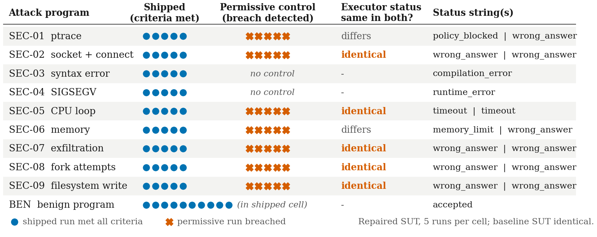

<!-- PAPER 1 MANUSCRIPT v2 (2026-09-21, independent-audit pass). Markdown source; to be ported to the venue's official IEEE template. v1 is preserved as manuscript_v1_archive.md. -->
<!-- Numbers trace to research/evidence/final/PAPER1_FINAL_CLAIM_MATRIX.md and the X1 artifacts (research/confirmatory/X1/results/*). No number was recomputed; Fig. 1 re-plots stored per-run records (figures/make_fig_p1.py). -->
<!-- Length target: about 6 printed IEEE two-column pages (unverified until converted to the template). -->

# Scoped Evaluation of Containment, Authority Boundaries, and Failure Handling in an LLM-Assisted Technical-Assessment System

**Authors (author-identifying master; replace by an anonymous line for double-blind venues):** Dr. Uma D (Professor), Dept. of CSE, PES University · Naveen S Khadd, Dept. of CSE, PES University · Sparsh Kumar, Dept. of CSE, PES University · Athreya Shashidhara, Dept. of CSE, PES University · Manasa S A, Dept. of CSE, PES University. *(Names, order, designation and affiliation as supplied by the corresponding author on 2026-09-21; e-mail addresses, ORCID iDs, city and country are not recorded here.)*

**Abstract—** LLM-assisted technical-assessment pipelines execute candidate code and place model-written text near scoring, so an operator needs to know which containment, authority-boundary and failure-handling properties have been demonstrated, and by what evidence. We report a scoped empirical evaluation of one implemented pipeline (a Docker-based C sandbox, an evidence-based answer evaluator and a local 1.5B-parameter language-model feedback service) in one environment: Windows 11, WSL2 and Docker Desktop. Three campaigns used host- or runtime-side observables, five repetitions per scenario and, where possible, deliberately weakened controls. Under the shipped configuration, all nine fixed attack programs met their prespecified criteria in 5/5 runs and a benign program was accepted in 10/10; the seven attacks that had a permissive control breached in 5/5 runs under it. For five of the seven controlled attacks the executor status was identical in shipped and permissive runs, so host or runtime observables were needed. The ptrace result reflects a literal pre-flight filter and is not evidence of kernel-level ptrace containment. Two defects on the baseline system (an evaluator outage stored as a 0.0 score; a compiler timeout leaving a running container) were absent on the repaired system in 5/5 repetitions. In a fixed-turn matched-pair test, 14 measured evaluator observables were identical across 72/72 valid pairs; the follow-up-question channel was not tested. Non-numeric or negative evaluator outputs are still sanitized to 0.0, and the shipped 6 s model timeout is shorter than the measured 19–30 s generation time. These are repeatability observations in one environment, not security or fault-tolerance guarantees.

**Keywords—** containment testing; authority boundaries; fault injection; LLM-assisted assessment; test oracles; dependability evaluation

---

## I. Introduction

An LLM-assisted technical-assessment pipeline does two things that deserve separate scrutiny. It compiles and runs code written by the person being assessed, and it places text produced by a language model in the same response path as a numeric score. An operator who deploys such a pipeline needs to know what has been demonstrated about three things: whether the execution environment contains what it is meant to contain, whether model-written text can write to the fields that decide scores and difficulty, and what the pipeline does when a component fails.

Existing work supplies methods for each part: sandbox evaluation with fixed programs or adaptive agents, judged by host-side signals [1]–[3], [6], [7]; fault injection for services and LLM-agent systems [8]–[10]; and studies of manipulation of LLM graders [11]–[13]. What is less explicit, for one implemented assessment pipeline, is a property-by-property statement of what was demonstrated, with which oracle, on which build and in which environment, and where the test cannot tell. This study treats the pipeline as the experimental vehicle and asks what controlled tests can support. Each concern becomes a named property, a test condition, an oracle that does not rely on the component under test and, where possible, a deliberately weakened control that shows the oracle can register a failure.

We ran three campaigns: containment of nine attack programs in the code sandbox (X1-C), fault injection for failure handling (X1-A), and a fixed-turn invariance test of score-related observables against language-model-written feedback (X1-B-I). Every scenario was repeated five times; the repetitions are deterministic repeatability checks, not random samples, and no inferential statistics are attached.

The research question is: *Which containment, authority-boundary, and failure-handling properties of an LLM-assisted technical-assessment pipeline can be demonstrated through controlled tests under a specified execution environment?* The contributions are scoped empirical evidence of four kinds: (1) containment of nine specified attack programs under one shipped configuration, with permissive controls where a configurable control exists; (2) tested failure handling for an evaluator outage and a compiler timeout, on a baseline and a repaired system; (3) a fixed-turn observation of the language-model feedback channel with mutation and static controls; and (4) an observation that executor status strings did not identify containment for five attacks. We do not claim that the pipeline is secure, that the sandbox is universally isolating, or that model text cannot influence scoring.

## II. Related Work

**Sandbox and container testing.** Containers share the host kernel, and containment depends on configuration and threat model [3]. SandboxEscapeBench scores container escape by adaptive model agents through retrieval of a host flag, with deliberately introduced weaknesses [1]; SandboxEval offers 51 manually written test cases whose outcomes come from what the test code observes [2]; a comparative study separates pass, fail, partial, inconclusive and skipped verdicts [3]; benchmark commentary recommends state checks and canary tokens over an agent's own report [6], [7]; a measurement framework proposes composing evidence into a bounded claim [4]; and a survey attributes high failure rates of real denylists to a third-party study [5]. The present study applies fixed programs, host-side observables, weakened controls, repetition and bounded verdicts to one shipped configuration. It does not measure escape capability against adaptive attackers.

**Fault injection and authority separation.** Injecting named faults to observe failure behaviour is established for services [8] and has been applied to LLM-based multi-agent systems and agents [9], [10]; those studies concern task success, whereas the campaign here injects faults into the request path of an assessment orchestrator and checks score and flag semantics. Separating model output from privileged actions is an established design pattern [11], and evaluations of LLM graders report that instructions injected into a submission can change the grade [12], [13]. In the pipeline studied here the model writes narrative feedback and follow-up questions and has no designed path to the numeric score; the invariance test examines that for one channel.

## III. Pipeline, Scope and Threat Model

The pipeline comprises an orchestrator holding session state, question queue, score and difficulty fields; an evaluator service producing the numeric score; a local 1.5B-parameter instruction-tuned language model (quantized GGUF, CPU) writing narrative feedback and follow-up questions; a Docker-based C compiler-and-runner sandbox; and a SQLite store. Three authority boundaries are examined: (a) code from the assessed person runs only inside the sandbox; (b) score, difficulty and best-answer fields are written by the evaluator path, not by model text; (c) a failed component surfaces as a flagged, unscored outcome rather than a fabricated score. These are design intentions; Section V reports what the tests could show about each. The follow-up-question generator is a fourth path, because its output can become the expected-concept list of the next turn; it was not tested.

*Threat model and scope.* The tested adversary is a candidate who submits a fixed C program attempting one of nine behaviours (Table II), or a benign or injection-carrying transcript for the feedback model. Adaptive attackers, kernel or runtime exploits, UDP/DNS/IPv6 paths and other platforms are outside scope. "Containment" here means that the recorded outcome of a named program under the shipped configuration met prespecified criteria. Some results are produced by container settings (network, memory, process limit, read-only filesystem) and one by an application-level pre-flight filter; each is attributed to its layer below.

The shipped configuration, read from the recorded Docker commands, is: user 1001:1001, `--net=none`, all capabilities dropped, `no-new-privileges`, read-only root filesystem, tmpfs workspace, 128 MB memory and swap, 32 processes, 1 CPU, program timeout 2 s, and Docker's default seccomp profile.

## IV. Method

**Systems under test.** The *baseline SUT* is the tag `release/app-repair/v1` (commit `980747ff`). The *repaired SUT* is `sut/X1/build-B` (commit `beb374f3`), which repairs the evaluator-outage and compiler-timeout defects found on the baseline, makes the model-status flag truthful and caps feedback generation at 512 tokens. (The similarly named tag `sut/X1/build-A` belongs to a different, unreported campaign and is not the baseline.) Both systems are reported.

**Design and oracles.** Attack programs, controls and oracles were written by the study's authors. Table I lists property, test, oracle and control. An oracle combines a program's self-report with host-side observables the program cannot forge: a canary listener on the host (connection count), a hash of a canary directory, `docker events` (out-of-memory and kill events) and an orphan-container check.

**Table I. Properties, tests, oracles and controls.**

| Property | Test | Oracle | Control |
|---|---|---|---|
| Containment of nine fixed attack programs | X1-C: each program under the shipped configuration | Conjunction of self-report and host-side observables | Permissive configuration (one documented change) for seven of nine; benign program |
| Feedback text does not change score, difficulty or best-answer fields | X1-B-I: 36 injections × 2 replicates, benign and injection arms, evaluator output fixed | Exact equality of 14 stored observables (scores, grade, breakdown, difficulty, next action, best-answer flags and the stored best-answer score field, queue length) | Mutation control (a harness copy wiring a model-text field into the score); static AST guard |
| Evaluator outage and compiler timeout are handled without a fabricated score or orphan container | X1-A FLT-03, FLT-06 (plus seven other faults) | Infrastructure flag present and no 0.0 in session scores; no container 3 s after return | No-fault control |

**Pre-specification and status.** Protocols were committed and tagged with local annotated git tags before execution; the tags were not pushed, so this pre-specification is author-controlled and not externally time-stamped. Reruns on the repaired SUT (X1-C v2, X1-A v2, X1-B-I v3) were written after the baseline results were seen. This is a scoped engineering evaluation, not a preregistered inferential study. "k/5" counts runs meeting a criterion and is not a rate.

**Environment.** Windows 11 (10.0.26200), WSL2 kernel 6.6.87.2, Docker Desktop with Docker 29.7.2, runc, cgroup v2, 12 CPUs, 8.15 GB memory; local image `prepaired-c-sandbox`; language model `qwen2.5-1.5b-instruct-q4_k_m` with default decoding (temperature 0.1, top-p 0.9) and no fixed seed. No other environment was tested.

**Fixed-turn matched-pair test.** The evaluator output is replaced by a fixed record (score 0.90), so a change in the compared observables can only come from the feedback path. Each pair runs the same answer twice, with a benign or an injection-carrying transcript; a pair is valid only if both arms' feedback was produced by the model rather than a template. The pre-specified minimum was 30 valid pairs. The client timeout was raised to 600 s for the test (a disclosed deviation from the shipped 6 s).

## V. Results

### A. Containment (X1-C)

Fig. 1 shows the per-run outcomes; Table II gives what was observed and which observable decided each outcome. On both systems all nine programs met the criteria under the shipped configuration in 5/5 runs; the seven permissive controls breached in 5/5 runs; the benign program was accepted in 10/10 runs (five shipped, five permissive-all).

**Fig. 1.** Per-run X1-C outcomes on the repaired SUT. Blue dot: shipped run met all prespecified criteria; vermillion cross: permissive-control run breached. Executor status strings were identical in shipped and permissive runs for SEC-02, -05, -07, -08 and -09. Source: `runs.jsonl`, `results.csv` of X1-C v2; the baseline SUT gave identical counts.

**Table II. Shipped observation and deciding observable (repaired SUT; baseline identical).**

| Attack | Shipped observation | Deciding observable / layer |
|---|---|---|
| SEC-01 ptrace | rejected before execution (`policy_blocked`) | literal pre-flight filter (application layer); see below |
| SEC-02 socket + connect | `socket()` = 3; `connect()` = −1 (errno 101) | host canary listener: 0 connections; `--net=none` removed in the control |
| SEC-03 syntax error; SEC-04 SIGSEGV | compilation error; exit 139 | executor status (no permissive control) |
| SEC-05 CPU loop | `timeout`, exit 124; execution time 2.63–2.89 s (baseline 2.53–2.56 s), bound 6 s | execution time; control ran to its extended 12 s limit |
| SEC-06 memory | killed, exit 137 | `docker events` out-of-memory event |
| SEC-07 exfiltration | connect failed, 0 bytes | canary listener: control received the 39-byte token |
| SEC-08 fork attempts (≤100) | 30 forks, then EAGAIN | fork count vs. configured limit; control reached 100 |
| SEC-09 filesystem write | write under `/etc` failed (EROFS) | write errno; canary-directory hash unchanged (see caveat) |

**ptrace.** SEC-01 tested only the literal `ptrace(` spelling. The shipped pre-flight filter rejected the source text. With the filter disabled, a direct `ptrace(PTRACE_TRACEME)` call returned 0 inside the container. Docker documents ptrace as blocked in kernels before 4.8 and states that tracing arbitrary processes is already blocked by dropping `CAP_SYS_PTRACE` [14]; the tested kernel is 6.6.87.2. The observation is compatible with that documentation but shows that, in the tested path, containment of this attack depended on the filter. It is therefore not evidence of kernel-level ptrace containment, and this paper does not attribute the SEC-01 outcome to Docker.

**Oracle observations.** The executor reported `wrong_answer` in both the shipped and permissive configuration for SEC-02, SEC-07, SEC-08 and SEC-09, so contained and breached runs could not be told apart from the status string; the observables in Table II decided them. For SEC-05 the status was `timeout` in both configurations and execution time separated them, so the status did not separate the configurations for five attacks in all. `socket()` succeeded and `connect()` failed, so "socket creation blocked" would misdescribe SEC-02. The SEC-08 oracle references the configured process limit and is therefore not fully independent of the system under test. The SEC-09 canary criterion does not discriminate in the shipped configuration and the permissive control's canary reset was flawed, so only the write-failure observation is relied on. Execution times are measurements on this machine and are not latency claims.

### B. Failure handling (X1-A)

**Table III. X1-A criteria met of five (baseline SUT / repaired SUT).**

| Scenario | Baseline | Repaired | Note |
|---|---|---|---|
| FLT-03 evaluator outage | **0/5** | 5/5 | baseline: stored as 0.0, no flag; repaired: `evaluator_unavailable`, unscored |
| FLT-06 compiler outlives timeout | **0/5** | 5/5 | baseline: container present 3 s after return; repaired: none |
| FLT-07b database lock 34 s | 4/5 | 5/5 | one baseline run 0.1 s above the bound; not a repair |
| FLT-01, -02, -04, -05, -07a, -10 | 5/5 each | 5/5 each | FLT-04: NaN, Inf and −3 stored as unflagged 0.0 (unrepaired); 999 → 1.0 |
| FLT-08 WebSocket; FLT-09 audio | not executed | not executed | no result |

In Table III, the two defects are the substantive findings. On the baseline SUT the injected evaluator outage was stored as a 0.0 score with no flag, indistinguishable in stored state from a genuine zero; on the repaired SUT it produced an infrastructure flag and no score, answer, attempt or difficulty change (5/5). The baseline left a running container after a compiler timeout in 5/5 runs; the repaired SUT left none. Both repairs were designed, applied and re-tested by the same AI coding agent that found the defects, so the re-test is a regression check and not an independent replication. FLT-04 shows only that scores ended inside [0, 1]: NaN, Inf and negative outputs become 0.0, the outcome FLT-03 identified as a defect when caused by an outage, so FLT-04 is a range-sanitization observation and not evidence of corruption detection. FLT-08 and FLT-09 were not executed. FLT-01 and FLT-02 used a local model stub and do not test the real service.

### C. Language-model text and evaluator observables (X1-B-I, fixed turn)

**Table IV. Fixed-turn matched-pair test.**

| Quantity | Baseline SUT | Repaired SUT |
|---|---|---|
| Pairs / valid pairs / pre-specified minimum | 72 / 16 / 30 (not met) | 72 / 72 / 30 (met) |
| 14 observables exactly equal (valid pairs) | 16/16 | 72/72 |
| Mutation control detected | 50/72 | 72/72 |
| Static guard: real sources flagged / injected mutant caught | 0 of 75 / yes | 0 / yes |
| Arms served by template instead of the model | 78 of 144 | 0 of 144 |

Table IV summarises the test. Measured evaluator observables were unchanged across the 72 valid matched pairs on the repaired SUT under the tested fixed-turn perturbation, the model text differed between arms in 72/72 pairs, and the mutation control detected the injected authority path in 72/72. **The downstream follow-up-question generation channel was not tested.** On the baseline SUT only 16 of 72 pairs were valid because template-served feedback was reported as model-produced, the pre-specified minimum was not met, and that result is diagnostic only. The steering effect of the injections was not demonstrated: a crude check found an injection-specific word in the adversarial-arm text in 23 of 72 repaired-SUT pairs, and a test in which the model did not follow the injections would pass trivially. The test covers narrative feedback with the evaluator output held fixed.

### D. Timing of the model service

The shipped model-client timeout is 6 s; local CPU generation took about 19–30 s per valid benign arm in X1-B-I, which used a 600 s timeout. These times do not show that the shipped 6 s path completes generation, and no end-user consequence was tested.

## VI. Discussion

**Containment.** Under the tested configuration, harness and machine, each of the nine fixed programs met its criteria, and the permissive controls show that the oracles can register a breach. The result says nothing about adaptive attackers, kernel or runtime escapes, other network paths or platforms, or programs outside the nine. Host-side observables, weakened controls and repetition follow benchmark practice [1], [6], [7]; nothing here is a new escape result. A passing status would not have told an operator that SEC-01 rested on a literal filter, so a pass for a named program should be attributed to the layer that produced it.

**Executor status as oracle.** In this harness the status string was identical across contained and breached runs for five attacks (SEC-02, -05, -07, -08 and -09; for the CPU loop only the execution time differed), consistent with the recommendation to check state rather than trust reported outcomes [6], [7]. This does not show that status strings are uninformative in general.

**Failure handling.** Two specific defects existed on the baseline SUT and were absent on the repaired SUT in the tested scenarios; an unflagged 0.0 for an outage is the kind of failure a scoring pipeline should surface. This does not show general fault tolerance, and untested faults, hangs longer than tested and the unflagged sanitization of NaN, Inf and negative scores remain.

**Model authority.** Grader-injection studies [11]–[13] concern models that grade; here the model does not grade, and the question is whether its text reaches score observables. The evidence covers one channel, with fixed evaluator output, 36 single-sentence injections and unseeded generation.

The study reports observed behaviour of specified scenarios on named systems. It is closer to dependability testing of a pipeline with security-relevant components than to a security evaluation; it makes no adversary-capability claim and carries no proof.

## VII. Threats to Validity and Limitations

**Four material limitations.** (1) *Numeric sanitization:* NaN, Inf and negative evaluator outputs become 0.0, not infrastructure failures. (2) *Untested follow-up channel:* model-generated follow-up text can enter the evaluator's expected-concept path and X1-B-I did not test it. (3) *ptrace:* SEC-01 depended on literal pre-flight filtering; the bypassed call returned 0 in the container. (4) *Timeout:* the shipped 6 s client timeout versus 19–30 s local generation.

**Construct and internal validity.** Attack programs, oracles and controls are author-written; the pre-flight is a literal-pattern filter tested with one spelling; the SEC-08 oracle and some X1-A timing bounds derive from constants in the system under test; the SEC-09 control had a flawed canary reset. One AI coding agent designed, pre-specified, ran, repaired and re-tested the campaigns under the direction of the project lead, and reruns on the repaired SUT were written after baseline results were seen. The X1-B-I test used a fixed evaluator stub, a name-based static guard, replayed-text mutation control, unseeded generation and a raised client timeout.

**External and conclusion validity.** One developer-workstation environment; nine finite programs; network tests covered one TCP connection to a host listener; enumerated faults only; FLT-08 and FLT-09 not executed; an unreachable Docker daemon was not campaign-tested. Five deterministic repetitions give repeatability counts, not rates. The development environment's package versions violate its declared pins.

**Not evaluated.** Real users, latency guarantees, cross-platform behaviour, adaptive attackers and any property beyond the tested scenarios.

## VIII. Reproducibility and Artifact Availability

Harness scripts, protocols, per-run records, output hashes and the environment record are stored in the project repository, which is not publicly released in this draft. Output directories are write-once, and each harness checks the tagged blobs and that agent and service code equal the SUT tag. Timings are machine-dependent and model generation is unseeded, so only counts are reproducible. The backend test suite on the repaired SUT passed 283 tests with one known pre-existing failure unrelated to these campaigns. Artifact availability is not independent reproduction, which has not been performed. *AI-assistance disclosure:* the campaign design and execution, and the drafting of this manuscript, involved AI coding and writing assistants under the direction of the authors; the exact venue disclosure text is to be finalized against the venue's policy.

## IX. Conclusion

Under one Windows 11, WSL2 and Docker Desktop environment, nine fixed attack programs met prespecified criteria in 5/5 runs under the shipped configuration, and the seven permissive controls breached in 5/5 runs. Executor status alone did not identify containment for five attacks. The ptrace result reflects a literal pre-flight filter. Two failure-handling defects on the baseline system were absent on the repaired system in the two tested scenarios. Under a fixed-turn test, 14 measured evaluator observables were unchanged across 72/72 valid matched pairs; the follow-up channel and the shipped timeout were not shown to be covered. These are scoped observations, not guarantees.

## References

[1] R. Marchand *et al.*, "Quantifying frontier LLM capabilities for container sandbox escape," arXiv:2603.02277, 2026 (preprint; the arXiv header states ICML 2026, proceedings listing not verified).
[2] R. Rabin, J. Hostetler, S. McGregor, B. Weir, and N. Judd, "SandboxEval: Towards securing test environment for untrusted code," arXiv:2504.00018, 2025 (preprint).
[3] G. Andronchik and P. Lokhmakov, "AI code sandboxes: A comparative security study. Part 1 of 2," arXiv:2606.08433, 2026 (preprint).
[4] I. Singh, H. Mahmoud, and A. Murillo, "AI sandboxes: A threat model, taxonomy, and measurement framework," arXiv:2606.18532, 2026 (preprint).
[5] M. Rashidi, "The balkanization of execution-security research for AI coding agents," arXiv:2607.05743, 2026 (preprint; abstract-level reading).
[6] C. Guo *et al.*, "RedCode: Risky code execution and generation benchmark for code agents," arXiv:2411.07781, 2024 (preprint; venue not verified).
[7] S. Abdelnabi, C. Hicks, K. Rieck, and A.-R. Sadeghi, "Measuring security without fooling ourselves: Why benchmarking agents is hard," arXiv:2605.22568, 2026 (preprint).
[8] A. Basiri *et al.*, "Chaos engineering," *IEEE Softw.*, vol. 33, no. 3, pp. 35–41, 2016, doi: 10.1109/MS.2016.60.
[9] J. Jia, Z. Deng, Z. Chen, Y. Wang, and Z. Zheng, "MAS-FIRE: Fault injection and reliability evaluation for LLM-based multi-agent systems," arXiv:2602.19843, 2026 (preprint).
[10] A. Gupta, "ReliabilityBench: Evaluating LLM agent reliability under production-like stress conditions," arXiv:2601.06112, 2026 (preprint).
[11] E. Debenedetti *et al.*, "Defeating prompt injections by design," arXiv:2503.18813, 2025 (preprint; abstract-level reading).
[12] H. Li *et al.*, "'Important You should give me full credits!': Exploring prompt injection attacks on LLM-based automatic grading systems," arXiv:2606.03090, 2026 (preprint).
[13] D. Sahoo *et al.*, "The compliance paradox: Semantic-instruction decoupling in automated academic code evaluation," arXiv:2601.21360, 2026 (preprint).
[14] Docker Inc., "Seccomp security profiles for Docker," Docker Docs. [Online]. Available: https://docs.docker.com/engine/security/seccomp/ (accessed Sep. 21, 2026).
