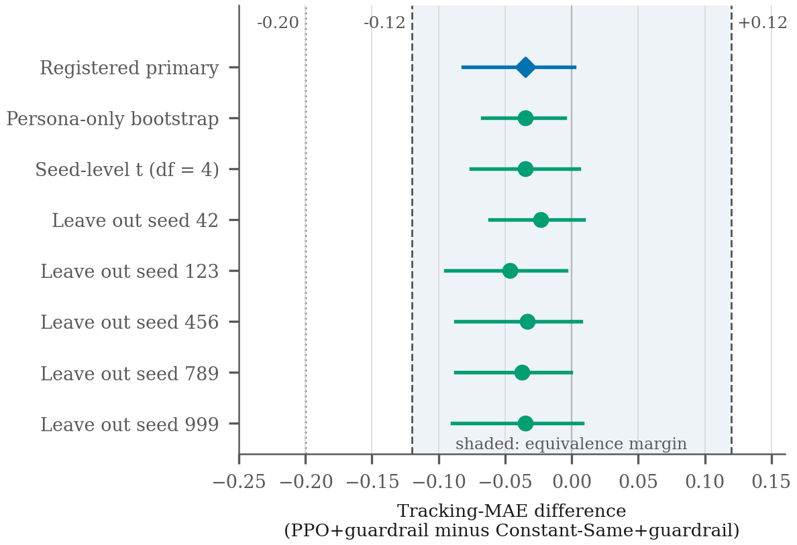
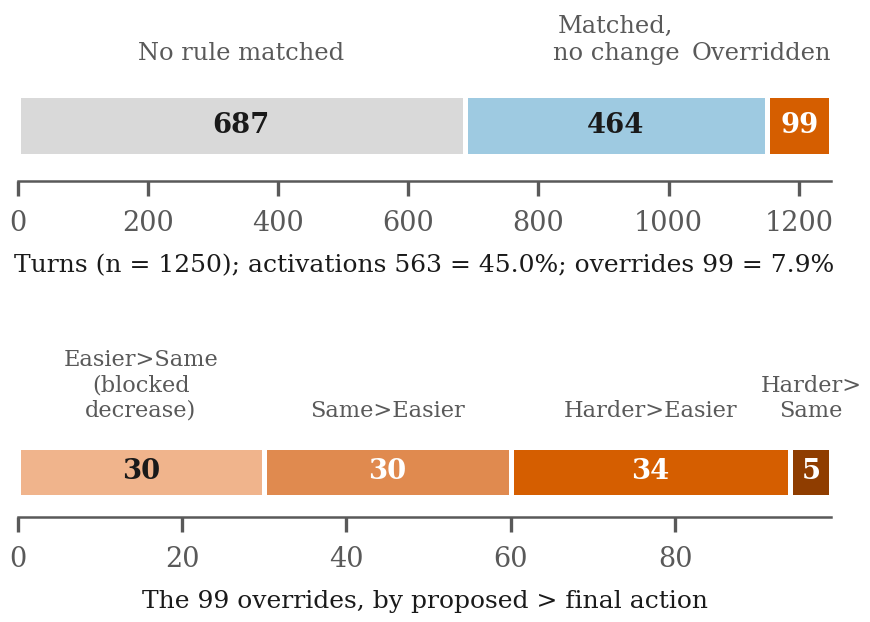
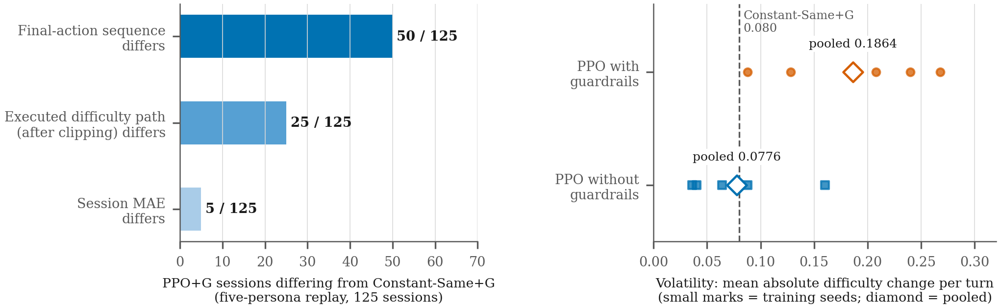

<!-- P3 HCII 2027 AIS FULL-PAPER DRAFT (content-complete; NOT converted to the Springer template; NOT author-verified; NOT submitted). Assembled 2026-09-21 by venue/HCII_P3/_build_full_manuscript.py from paper3/manuscript.md v2; all numbers reused verbatim from the traced ledger. -->

# A Controlled Equivalence Study of Learned and Constant Difficulty Policies in Simulated Technical Interviews

Dr. Uma D (Professor), Naveen S Khadd, Sparsh Kumar, Athreya Shashidhara, Manasa S A

Dept. of CSE, PES University

*(Author order, designation and affiliation as supplied by the corresponding author on 2026-09-21. E-mail addresses, ORCID iDs, city and country are not recorded here. HCII regular-paper review is single-blind, so names appear.)*

**Abstract.** Adaptive difficulty controllers for technical-interview practice are often reported with a learned policy and a rule-based constraint layer bundled together, so the learned component's own contribution is unclear. We report a controlled comparison in simulation in which a learned proximal-policy-optimisation (PPO) difficulty controller and a state-blind Constant-Same policy run under an identical application-level rule-based guardrail. Using five frozen PPO checkpoints, 40 authored candidate personas and 20 evaluation seeds, the primary endpoint, pre-specified in the project repository, was the persona-level difference in mean absolute error (MAE) between session difficulty and an authored target difficulty, analysed with a two-way cluster bootstrap over personas and training seeds against an author-selected equivalence margin of ±0.12. The difference (PPO minus Constant-Same) was −0.0350 (95% interval [−0.0818, +0.0021]), classified equivalent within the margin; superiority (upper bound below −0.20) was not met, and the classification was unchanged in seven sensitivity estimates from three pre-specified analyses. Equivalence does not mean identical behaviour. In a five-persona replay (1250 PPO turns), the guardrail activated on 563 turns (45.0%) and changed the selected action on 99 (7.9%); the final-action sequence differed from Constant-Same in 50 of 125 sessions, the executed difficulty path in 25 and session MAE in 5; guarded PPO was more volatile than both Constant-Same and unguarded PPO. The evidence is simulation-only, with authored personas, targets and margin, and checkpoints trained against a single simulated candidate. It supports no claim of learned-policy benefit or of benefit to real learners.

**Keywords:** adaptive difficulty; equivalence testing; reinforcement learning; simulated candidates; rule-based guardrails; technical interviews

---

## 1 Introduction

Adaptive systems for interview or tutoring practice adjust question difficulty in response to a learner's performance. When the adjustment policy is learned, and when a hand-written constraint layer sits between the policy and the learner, a measured outcome cannot be attributed to the learned component without a comparison in which the constraint layer is held fixed. Two questions follow: what does the learned policy add once the same constraints apply to a much simpler policy, and how differently do the two policies actually behave?

The literature makes both questions relevant. Simulation-based studies of adaptive mock-interview tutoring already compare rule-based heuristics with several reinforcement-learning methods, including PPO [1]. Reviews of reinforcement learning in education report inconsistent baselines, frequent reliance on simulated users, and that a minority of studies show learned policies significantly outperforming all baselines [2], [3]. Studies that compare learned tutoring policies with simple alternatives report cases in which the learned policy did not differ significantly from an expert policy [4], in which effect sizes may be too small for contextual policies to improve on policies that give the same action to all students [5], and in which a trained policy collapsed towards one action and performed close to a constant heuristic [7]. Constraint layers around learned tutoring policies have been studied as constrained optimisation, and comparisons of structural constraints with post-hoc filtering exist [8]. Equivalence conclusions require a stated margin and an interval inside it [12], [13]; evaluating reinforcement-learning results requires uncertainty over runs [10], [11].

What is less often reported is a comparison of a learned difficulty policy with a state-blind constant action under the same guardrail layer, with an equivalence analysis and an account of how often the guardrails act and how often the two policies actually diverge. This study provides that comparison for one set of frozen checkpoints in one simulator. It does not propose a new application, algorithm, simulator or benchmark; adaptive mock-interview tutoring with simulation, an item-response-theory-based learner model, a finite-horizon Markov decision process and a heuristic, DQN, PPO, PETS and MBPO comparison is already reported in [1], whose body we did not read beyond its abstract, highlights and contribution statements.

We evaluated the contrast, pre-specified in the project repository, between PPO with the guardrail layer and Constant-Same with the same layer, using persona-level tracking error, and we report guardrail accounting, trajectory divergence and volatility alongside. The primary result is an equivalence classification, with a difference of −0.0350 and an interval of [−0.0818, +0.0021] against an author-selected margin of ±0.12. Secondary analyses show that the policies are not behaviourally identical.

Section 3 states the research question and the contribution; Sections 4–8 describe the simulator, the policies, the guardrail, the protocol and the equivalence method; Section 9 gives the results; Sections 10–12 discuss them, their limits and their implications for adaptive instructional systems.

## 2 Related Work

**Adaptive mock-interview tutoring and reinforcement learning in education.** Kadam et al. report a simulation framework for benchmarking policies in adaptive mock-interview tutoring, with an item-response-theory-based response model, a finite-horizon Markov decision process and a comparison of a heuristic, DQN, PPO, PETS and MBPO under a common simulator, reward, state and seed protocol [1]. They describe the simulator as a controlled policy-comparison environment and not as a fully validated model of human learning. Riedmann et al. review 89 manuscripts on reinforcement learning in education and report that only 20% demonstrated a policy significantly outperforming all baselines (51% among papers with statistical tests), and call for more evaluation with actual users [2]. Doroudi et al. review reinforcement learning for instructional sequencing and report that policies constrained by learning-science theory were most successful [3]. This study is one further controlled comparison within that setting; it does not use the simulator or policies of [1].

**Simple baselines and near-equivalence.** Batch reinforcement-learning pedagogical policies did not differ significantly from an expert policy in one classroom study and, paired with simple explanations, improved learning performance significantly over the expert policy in a second [4]; a large-scale tutoring study reports that effect sizes may often be too small for contextual policies to improve on well-optimised policies that deliver the same action to all students [5]; in a simulated classroom, reinforcement learning and greedy heuristics gave similar results [6]; and a trained tutoring policy has been reported to choose one action in 99.9% of its final choices and to perform close to the constant heuristic [7]. These are heterogeneous settings, and none is evidence for the present simulator.

**Constraint layers.** In safe reinforcement learning, a "shield" denotes enforcement of a formally specified safety property [9]. The layer studied here is a hand-written set of rules with no formal specification and no safety guarantee, so we call it an application-level rule-based guardrail. Work on pedagogically constrained tutoring policies compares structural constraints with post-hoc filtering [8].

**Evaluation methodology.** Reporting uncertainty over runs and seeds [10], [11], and equivalence testing with a stated smallest effect of interest [12], [13], frame the analysis. We identified no external empirical justification for the pre-specified, author-selected margin of ±0.12, which is a design choice. Elo-type rating systems provide simple adaptive baselines in educational systems [14]; none was run here.

## 3 Research Question and Contribution

The research question is: *Under an identical rule-based guardrail layer, what does a learned PPO difficulty controller add beyond a simpler state-blind Constant-Same policy in simulated technical-interview trajectories?* It is answered by one pre-specified primary contrast (PPO with guardrails minus Constant-Same with guardrails; tracking error against an authored target) and by secondary, descriptive accounts of guardrail activity, behavioural divergence and volatility.

The contribution is controlled decomposition and equivalence evidence: (1) a matched-policy comparison under identical guardrails; (2) an equivalence result under a repository-registered protocol, with three pre-specified sensitivity analyses (seven estimates); (3) guardrail accounting that separates rule activations from action overrides and from attempted boundary actions; and (4) an explicit list of what the simulation cannot support. Equivalence within a margin is not evidence of no difference. The paper does not claim learned-policy superiority, learner benefit, real-candidate validity or a safety guarantee, and it proposes no new application, algorithm, simulator or benchmark.

## 4 The Simulator

**State, actions and simulator.** The controller observes a 6-dimensional state in [0, 1] (latest score, rolling mean of the last five scores, confidence, hesitation, progress, and difficulty divided by 5) and chooses among three actions: Easier, Same, Harder. A simulated candidate has a persona type and a skill and produces a performance, confidence, hesitation and response-time signal for the current difficulty. Difficulty lies in [1, 5] and starts at 3.0 in evaluation; each action moves difficulty by one integer step, clipped at the bounds. The simulator, the persona types and the target rule are authored by the study team. Simulated candidate outputs are not calibrated to real candidates.

**Personas and target.** The primary stratum is a full factorial of five persona types (normal, nervous expert, lucky guesser, overconfident-fail, struggling junior) and eight skills (0.20 to 0.90), giving 40 personas. Each persona's target difficulty is round(10·skill)/2 (1.0 to 4.5), an authored rule not tuned per persona. A session has 10 turns. The tracking error of a session is the mean absolute difference between the difficulty at each turn and the target.

## 5 Policy Definitions

**Policies.** *PPO*: the five frozen checkpoints (training seeds 42, 123, 456, 789, 999), each trained for 24,576 timesteps with a stable-baselines PPO (MLP 64×64, learning rate 3·10⁻⁴, γ = 0.99, clip 0.20), evaluated deterministically. The training reward is a weighted sum containing a decision-alignment term (agreement of the chosen action with an authored oracle rule, weight 0.60), an outcome-change term, a shaping term, a stability penalty and critical-state terms. Each checkpoint was trained against a single default simulated candidate (persona normal, skill 0.60, target 3.0), with the guardrail layer active inside the training environment, 15-turn episodes and continuous 0.1 difficulty steps; evaluation uses 10 turns and integer steps. The candidate's noise was unseeded in training, so the checkpoints are frozen artifacts and cannot be regenerated. *Constant-Same*: always proposes Same and has no state input. *Comparators for secondary contrasts*: a threshold heuristic, an oracle rule, a controller acting on the gap between the rolling-average score and the current difficulty (documented as exploiting the persona target rule), a uniform random policy, and PPO with the observation zeroed or taken from another persona.

## 6 The Application-Level Rule-Based Guardrail

**Application-level rule-based guardrail layer.** Rules are applied in a fixed priority order to the proposed action. G0 (infrastructure failure) holds difficulty; G4 (score below 0.30 and hesitation above 0.60) forces Easier; G1 (score below 0.30 at mid difficulty) forces Easier; G2 (confidence below 0.30, hesitation above 0.70, score below 0.80) forces Same; G5 (score between 0.40 and 0.65 with rolling mean below 0.60) forces Same; G6 (score at least 0.90 and a large gap, not a nervous expert) forces Harder. The layer is identical for both policies. We distinguish three counts: a *rule activation* is a turn on which any rule matched; an *action override* is a turn on which the final action differs from the proposed action; and an *attempted boundary action* is a final action that would move difficulty beyond [1, 5] before clipping. The frozen code names the activation flag "overridden", which is not the meaning used here. We call none of these counts "interventions". The layer has no formal safety specification, and no safety guarantee is claimed; boundary-saturated attempted actions are counted before simulator clipping and are not called violations.

## 7 Experimental Protocol

**Primary comparison (X3-A).** The contrast is PPO with guardrails minus Constant-Same with guardrails, over 40 personas, 20 evaluation seeds and 5 training seeds. The unit is the persona: for each persona, session tracking error is averaged over the 20 evaluation seeds, and the PPO term is averaged over the 5 training seeds. The estimate is the mean of persona-level differences over the 40 personas. Sessions and turns are descriptive. A follow-up retraining experiment (X3-B) was to run only if the class were not equivalent; it was not triggered.

**Secondary contrasts.** Volatility (mean absolute difficulty change per turn), oscillation, observation use, comparators, guardrail on versus off and rule ablations are descriptive, with no multiplicity control.

**Five-persona frozen replay.** The behavioural accounting in Sections 9.3 and 9.4 use an evaluation-only replay of the frozen checkpoints on five previously fixed personas (skills 0.20, 0.30, 0.60, 0.80, 0.88; targets 1.0, 1.5, 3.0, 4.0, 4.5), 5 evaluation seeds and 5 training seeds (25 sessions of 10 turns per condition; 125 PPO sessions). It is a separate, descriptive dataset and its results are never merged with the 40-persona result.

**Registration status.** Throughout this paper, "registered" and "pre-specified" mean that the protocol, harness and sensitivity analyses were committed and marked with annotated git tags in the project repository before the runs. No external registry entry was made, the repository was not pushed to a public registry, and the tags are controlled by the authors and carry no external time stamp.

## 8 Equivalence and Sensitivity Method

**Interval and classification rule.** The interval is a two-way cluster bootstrap that resamples the 40 personas and the 5 training seeds with replacement (B = 10,000, seed 42, 95% percentile). The pre-specified classification rule is: *equivalent* if the interval lies entirely inside (−0.12, +0.12); *PPO-superior* if its upper bound is below −0.20; *PPO-adverse* if its lower bound is above +0.12; otherwise inconclusive. The margin of ±0.12 and the superiority threshold of −0.20 were pre-specified and author-selected; no external empirical justification for either was identified, and none is offered here. Equivalence within the margin means that the whole interval lies inside it; it is not evidence that the difference is zero.

**Pre-specified sensitivity analyses (O7).** Three analyses were pre-specified before they were run, as secondary evidence: a persona-only bootstrap (checkpoints fixed), a seed-level t interval (df = 4), and leave-one-seed-out. A reproduction gate reproduced the primary estimate exactly.

## 9 Results

### 9.1 Primary equivalence result

**Table 1. Pre-specified primary result (40 personas × 5 training seeds; tracking MAE, PPO+guardrail minus Constant-Same+guardrail).**

| Quantity | Value |
|---|---|
| Difference | −0.0350 |
| 95% two-way cluster bootstrap interval | [−0.0818, +0.0021] |
| Persona-level SD of differences; Cohen's d_z | 0.1015; −0.345 |
| Equivalence margin; superiority threshold | ±0.12; −0.20 |
| Classification | Equivalent (interval inside ±0.12); superiority not met |
| Mean MAE: Constant-Same+G; PPO+G (descriptive) | 1.1039; 1.0688 |

Both policies had a mean tracking error close to one difficulty level. Constant-Same without guardrails has a mean error of exactly 1.000, because the starting difficulty (3.0) lies at the centre of the target range, so a policy that never moves is a strong reference in this simulator. Equivalence within ±0.12 means the interval lies inside the pre-specified margin; it is not evidence that the difference is zero, and it does not support a claim that PPO tracks better. The interval's upper bound (+0.0021) is close to zero and its lower bound (−0.0818) is well above the superiority threshold.

### 9.2 Sensitivity results

**Table 2. The seven sensitivity estimates from three pre-specified analyses (difference = PPO+G minus Constant-Same+G); the first row repeats the primary result.**

| Analysis (comparison) | Difference | 95% interval (method) | Equivalence class |
|---|---|---|---|
| Pre-specified primary | −0.0350 | [−0.0818, +0.0021] | Equivalent |
| O7-A persona-only bootstrap (checkpoints fixed; B = 10,000) | −0.0350 | [−0.0673, −0.0052] | Equivalent |
| O7-B seed-level t interval (df = 4; five seed-level differences) | −0.0350 | [−0.0758, +0.0057] | Equivalent |
| O7-C leave out seed 42 (two-way bootstrap, four seeds) | −0.0234 | [−0.0614, +0.0092] | Equivalent |
| Leave out seed 123 | −0.0463 | [−0.0948, −0.0043] | Equivalent |
| Leave out seed 456 | −0.0335 | [−0.0874, +0.0070] | Equivalent |
| Leave out seed 789 | −0.0372 | [−0.0873, −0.0005] | Equivalent |
| Leave out seed 999 | −0.0348 | [−0.0898, +0.0078] | Equivalent |

In Table 2, all eight intervals (the primary and the seven estimates) lie inside ±0.12 and none has an upper bound below −0.20, so superiority was never established. Fig. 1 plots them against the margin.

**Fig. 1.** Primary interval (diamond) and the seven sensitivity estimates for the difference in tracking MAE, PPO with guardrail minus Constant-Same with guardrail. Shaded band: equivalence margin (−0.12, +0.12); dotted line: superiority threshold (−0.20). Sources: `x3a_decision.json`, `x3a_o7_results.json`. Three of these intervals (persona-only, leaving out seed 123, leaving out seed 789) exclude zero on the side numerically favouring PPO; the persona-only interval excludes checkpoint-to-checkpoint variability by design. These results leave the pre-specified classification unchanged but do not license the statement that PPO tracks better. Seed-level differences were −0.0816 (seed 42), +0.0100 (123), −0.0411 (456), −0.0266 (789) and −0.0359 (999); the persona-level SD (0.1015) is about three times the mean difference. Sensitivity analyses are secondary and do not replace the pre-specified result.

### 9.3 Guardrail accounting (five-persona replay)

The application-level rule-based guardrail activated on 563 of 1250 turns (45.0%). Of those activations, 99 changed the selected action (7.9% of all turns), while 464 were no-op activations. At least one actual override occurred in 41 of 125 sessions. Fig. 2 shows the accounting.

**Fig. 2.** Accounting of the 1250 PPO+guardrail turns of the five-persona replay. Top: turns with no rule match, rule matches that left the proposed action unchanged, and overrides. Bottom: the 99 overrides by proposed and final action. Source: `x3_0c_replay_turn_log.csv`.

**Table 3. Guardrail accounting for PPO+guardrail, five-persona replay (125 sessions, 1250 turns).**

| Count | Value | Definition |
|---|---|---|
| Rule activations | 563 of 1250 turns (45.0%) | any rule matched |
| Action overrides | 99 of 1250 turns (7.9%) | final action differs from proposed action |
| Activations that did not change the action | 464 | matched rule agreed with the proposal |
| Sessions with at least one override | 41 of 125 | — |
| Boundary-saturated attempted actions before simulator clipping: guardrails on / raw PPO | 232 (18.6%) / 136 (10.9%) | final action would move difficulty beyond [1, 5]; not called violations |

Table 3 gives the counts and their definitions. By rule, activations were G5 205, G4 167, G1 111 and G2 80; G6 never matched. Overrides came from G1 (49), G2 (35) and G4 (15); G5 (205 activations) never changed the action, and all overrides arose in two of the five personas. By direction (D): 30 overrides replaced a proposed Easier by Same (blocked decreases); 39 replaced a proposed Harder (blocked increases: 34 by Easier and 5 by Same); and 30 replaced Same by Easier. The layer thus both prevented and forced decreases in the proposed difficulty and did not act only towards easier questions. The 563 activations are not interventions: 82.4% of them (the 464 no-op activations) coincided with the proposed action. For Constant-Same with the layer, 100 of 250 turns activated a rule, 43 were overrides and 10 of 25 sessions had at least one override.

### 9.4 Behavioural divergence (five-persona replay)

Constant-Same with guardrails had a mean tracking error of 0.6728 in the five-persona replay, against 0.6772 for PPO with guardrails (pooled). Of the 125 PPO+guardrail sessions, the final-action sequence differed from that of Constant-Same+guardrails in 50 (40%), the executed difficulty path (after clipping) differed in 25 (20%), and the session tracking error differed in 5 (4%). The three counts follow different definitions and are not interchangeable: a proposed Easier at difficulty 1.0, for example, changes the action sequence without changing the executed path. Tracking error therefore cannot distinguish policies whose paths differ in shape without differing in mean distance to the target. Session-level divergence on the 40-persona grid is not stored in a summary and is not reported here.

### 9.5 Volatility

On the 40-persona grid, PPO with guardrails was more volatile than Constant-Same with guardrails (difference +0.14877, 95% interval [0.0666, 0.25445]) and had a higher oscillation rate (+0.25061 [0.13027, 0.38584]). Guarded PPO was also more volatile than PPO without guardrails (mean volatility 0.2463 versus 0.0804; point values, no stored interval), and in the five-persona replay the pooled values were 0.1864 for guarded PPO and 0.0776 for raw PPO (oscillation 0.1603 and 0.0613); Constant-Same with guardrails had a volatility of 0.080 and an oscillation of 0.0. The guarded policy is therefore not smoother than the unguarded one in these data, and no claim of reduced volatility is made. Volatility is a secondary metric and was analysed descriptively. Fig. 3 shows the divergence counts and the stored volatility values.

**Fig. 3.** (A) Number of the 125 PPO+guardrail sessions (five-persona replay) whose final-action sequence, executed difficulty path or session MAE differed from Constant-Same+guardrail; the three counts follow different definitions. (B) Volatility (mean absolute difficulty change per turn) of PPO with and without guardrails: small marks are the five training seeds, diamonds the pooled values; the dashed line is Constant-Same+guardrail. Sources: `x3_0c_followup.json`, `x3_0c_replay_summary.csv`.

### 9.6 Secondary contrasts (descriptive)

**Table 4. Secondary contrasts on the 40-persona grid (difference in MAE unless stated; no multiplicity control).**

| Contrast | Difference | 95% interval |
|---|---|---|
| PPO+G, zeroed observation minus PPO+G | +0.36982 | [0.09077, 0.64148] |
| PPO+G, observation from another persona minus PPO+G | +0.25382 | [0.10948, 0.41417] |
| PPO+G minus heuristic+G | −0.46414 | [−0.7134, −0.22601] |
| PPO+G minus rolling-average controller+G | −0.30084 | [−0.51982, −0.09469] |
| PPO+G minus oracle-rule+G | −0.10698 | [−0.21823, 0.00841] |
| Constant-Same+G minus Constant-Same without guardrails | +0.10386 | [−0.18375, 0.38796] |
| PPO without guardrails minus Constant-Same without guardrails | −0.06166 | [−0.18481, 0.06173] |
| Removing rule G1: PPO+G / Constant-Same+G | −0.08725 / −0.14557 | [−0.23925, 0.03782] / [−0.34944, 0.03637] |

Table 4 shows that PPO reads its observation: replacing it with zeros or another persona's observation raised the tracking error. That shows the policy is state-dependent; it does not show that the state dependence improves tracking relative to Constant-Same (Table 1). The comparators are authored controllers, and the oracle rule and the rolling-average controller share the persona-target structure. In the five-persona replay the heuristic had a lower tracking error (0.473) than PPO with guardrails (0.677); the two comparisons use different persona sets and are reported separately. On the grid the guardrail layer did not improve tracking for Constant-Same (1.104 with versus 1.000 without), and the five-persona improvement from 1.200 (Fixed at 3.0) to 0.673 did not generalise to the grid. Removing single rules other than G1 changed tracking error by less than 0.03.

### 9.7 Action distribution

The training-time share of the Same action for the stochastic policy in the last logging window was 0.5069, 0.5130, 0.5345, 0.5168 and 0.5247 for seeds 42, 123, 456, 789 and 999 (24,576 timesteps each). In a stored probe sweep of the seed-123 checkpoint, 8 of 66 probes chose an action other than Same, at one neutral point of the other state coordinates. The evaluation-time Same share was not stored in the publication summary and is therefore not quantified here. A policy that often proposes Same is close to the state-blind comparator by construction, which is compatible with the equivalence result but is not tested as its explanation.

## 10 Discussion

**Equivalence.** With this simulator, the shared guardrail layer and these five checkpoints, mean tracking error differed by −0.0350 between PPO and Constant-Same, and the interval lies inside ±0.12. That does not mean the two policies are the same, that PPO has no effect (three sensitivity intervals exclude zero), or that a differently trained PPO would also be equivalent. Learned policies that match simple or expert policies are reported in other settings [4]–[7], and the equivalence framing follows [12], [13]; here the pre-specified rule requires the whole 95% interval inside the margin. The result limits what can be credited to the learned policy in this design, because the tracking result does not identify a contribution of the learned component beyond the guardrails. It has no practical implication for learners, since the study makes no claim about real interviews, and the ±0.12 margin has no external justification, so whether ±0.12 difficulty levels is practically small has not been evaluated.

**Why an equivalence result is informative.** The design isolates the learned component: the same constraint layer is applied to both policies, the null is a state-blind constant, the equivalence rule was pre-specified before the run, sensitivity analyses were pre-specified, and behaviour is accounted for separately. The result is informative because it shows that, in this simulator and for these checkpoints, adding a learned policy to a guardrail layer did not measurably change mean tracking error, while the divergence analysis shows where the policy does change behaviour (50 of 125 final-action sequences, 25 of 125 executed paths, higher volatility). It is not a product success result and does not indicate that PPO is unhelpful in general.

**Behaviour beyond the mean.** PPO reads the state (zeroing or shuffling the observation raised tracking error), is more volatile, and has its proposed action changed by the layer on 7.9% of five-persona turns. None of this shows that state dependence helps tracking, or that guardrail activation counts measure safety outcomes. The guardrail accounting rests on five authored personas.

**Foreseeable objections.** Constant-Same is a strong reference here because difficulty starts at the centre of the target range; it is state-blind, and other nulls, such as an Elo or item-response baseline, were not run. The margin has no external justification. The reward includes an oracle-alignment term and the target is an authored rule; that coupling was not re-audited, although PPO was not trained to minimise the tracking error. Each checkpoint saw 24,576 timesteps against one candidate, and the effect of longer or broader training was not tested. The simulator is authored and uncalibrated, so it may bias the result, and training differs from evaluation as described in Sections 4–6. PPO does respond to the state in this simulator. Equivalence within an author-selected margin says that PPO adds little to mean tracking error for these checkpoints in this simulator; the policies still differ in action sequences, executed paths and volatility, and nothing is inferred about learners.

## 11 Limitations and Threats to Validity

**Scope.** Simulation only: no human learners, no real-candidate evidence, and no evidence of learning outcomes. The simulator, persona structure, target difficulty rule and comparator controllers are authored by the study team, and the reward contains an oracle-alignment term (weight 0.60) whose coupling to the authored evaluation target was not re-audited; PPO was not trained to minimise the tracking error, but the alignment may favour the target structure. The five training seeds are a hypothetical population, training and evaluation differ (Sections 4–6), and no Elo, item-response or computerized-adaptive-testing baseline was run.

**Training and evaluation.** Five checkpoints from one training seed set, a hypothetical population (df = 4 in the seed-level analysis); each trained against a single candidate, so 39 of the 40 grid personas were unseen; training used the guardrail layer inside the loop, 15-turn episodes and continuous steps, while evaluation uses 10-turn integer steps; the training candidate's noise was unseeded, so checkpoints cannot be regenerated. The demonstration policy deployed in the application is a different checkpoint from the evaluated seed-123 checkpoint and differs from the training state definition (a runtime state-definition mismatch); no claim is made about the application.

**Design.** The ±0.12 margin is a design choice without literature justification; tracking error ignores path shape; no Elo, item-response or adaptive-testing baseline; the heuristic tracked better than PPO with guardrails in the five-persona replay and worse on the grid; the guardrail layer has no formal specification; evaluation-time action shares and grid-level session divergence are not stored; the five-persona accounting rests on five authored personas; the registration tags are local and unpushed. Secondary contrasts have no multiplicity control.

**Equivalence.** Equivalence is not "no effect", and it applies to these checkpoints in this simulator. A retraining experiment across a persona distribution was not run.

## 12 Implications for Adaptive Instructional Systems and HCI

The study is a simulation, so its implications concern how adaptive instructional systems are evaluated and reported, not how learners respond. Five points follow, each tied to a result above.

**Report the constraint layer as part of the result.** When a learned difficulty policy runs behind rules, activation, override and boundary counts are findings. In the replay, the layer activated on 45.0% of turns but changed the selected action on 7.9%, and 464 of the 563 activations coincided with the proposed action; describing all activations as interventions would misstate how much the layer acted on the policy. The count of sessions with at least one override (41 of 125) is a further, separate quantity.

**Include a matched, simpler baseline.** A state-blind constant action under the same layer set a reference that the learned policy did not measurably beat on the pre-specified endpoint. An adaptive system evaluated without such a baseline leaves open whether the constraint layer, the simulator or the learned component produced the outcome.

**State the margin and where it comes from.** An equivalence classification is conditional on its margin. Here the margin (±0.12 difficulty levels) is author-selected, and whether such a difference matters to a learner is a question for learning-science and human-centred evaluation, which this study does not address.

**Look beyond the mean.** Equal mean tracking error coexisted with different action sequences (50 of 125 sessions), executed paths that differed in 25, and higher volatility of guarded PPO (+0.14877 on the grid). A learner or candidate experiences the sequence of questions and not the mean, so path shape and volatility are relevant to interaction design. Whether they are perceived by, or matter to, real users was not studied.

**Human-centred evaluation remains open.** No learners, real candidates, usability measures or learning outcomes are reported. Before any claim about a deployed adaptive system, the evaluation would need real candidates, ethical review appropriate to the setting and learner-centred outcome measures; none of these is implied by the present results, and the demonstration policy in the application differs from the evaluated checkpoints (Section 11).

## 13 Reproducibility and Artifact Availability

The pre-specified analysis ran in a locked environment (Python 3.12.7, recorded lock file), with a harness gate that reproduced the frozen evaluation loop on the five-persona study exactly and required deliberately altered rule or heuristic variants to be detected before the run. Two dry runs of that gate failed its mutant-detection check before any confirmatory data existed and were resolved by replacing the mutant with one the fixture exercises, and a first primary-run attempt was aborted when its process was killed; the records of all three are retained. The primary analysis used bootstrap seed 42 with B = 10,000; the sensitivity analysis reproduced the primary estimate with zero difference. Checkpoints and the session-level results of the 40-persona study are hash-pinned in the project repository. Retraining the checkpoints from the recorded seeds is not reproducible because of unseeded candidate noise; the checkpoints are frozen artifacts and not regenerated. The repository is not publicly released in this draft. Having the artifacts available is not the same as an independent reproduction, which has not been performed.

## 14 Conclusion

In a controlled simulation in which a learned PPO difficulty controller and a state-blind Constant-Same policy ran under an identical rule-based guardrail layer, the pre-specified persona-level tracking-error difference was −0.0350 (95% interval [−0.0818, +0.0021]), equivalent within ±0.12 and unchanged under three pre-specified sensitivity analyses; superiority was not established. The two policies nonetheless differ in behaviour (final-action sequences in 50 of 125 five-persona sessions, and higher PPO volatility), and the guardrail activated on 45.0% of turns while changing the selected action on 7.9%. The findings concern five checkpoints in an authored simulator with an authored margin, and they support no claim about real learners. Future work would train across a persona distribution, add rating-system baselines and, before any learner-facing claim, evaluate with real candidates.

## Declarations (drafts; AUTHOR CONFIRMATION REQUIRED for every bracket)

**Authors and affiliations.** As on the title page. E-mail addresses, ORCID iDs, city and country are not recorded here [AUTHOR CONFIRMATION REQUIRED].

**Ethics.** This study used simulated candidates only: no human participants and no personal data were involved in the reported experiments. [Confirm with the authors and, if required, the venue.]

**Use of AI tools.** [PLACEHOLDER: AUTHOR CONFIRMATION REQUIRED. The tool(s), version(s), sections affected and level of author review are not established in the repository record and are not stated here. The Springer Nature and HCII wording must be checked at submission time; see `cross/AI_DISCLOSURE_FACT_CHECK.md`.]

**Data and code availability.** The repository is not publicly released in this draft. [Release decision: AUTHOR CONFIRMATION REQUIRED.]

**Competing interests.** [AUTHOR CONFIRMATION REQUIRED.]

## References

[1] Kadam, S., Banerjee, S., Christopher, J., Praveen Kumar, P.T.V., Satpathi, D.K.: A simulation framework for benchmarking reinforcement learning policies in adaptive mock-interview tutoring. Simul. Model. Pract. Theory 151, 103316 (2026). https://doi.org/10.1016/j.simpat.2026.103316 (publisher landing page read: abstract, highlights and contribution statements; article body not read)

[2] Riedmann, A., Schaper, P., Lugrin, B.: Reinforcement learning in education: a systematic literature review. Int. J. Artif. Intell. Educ. 35(5), 2669–2723 (2025). https://doi.org/10.1007/s40593-025-00494-6

[3] Doroudi, S., Aleven, V., Brunskill, E.: Where's the reward? A review of reinforcement learning for instructional sequencing. Int. J. Artif. Intell. Educ. 29(4), 568–620 (2019). https://doi.org/10.1007/s40593-019-00187-x

[4] Sanz Ausin, M., Maniktala, M., Barnes, T., Chi, M.: Exploring the impact of simple explanations and agency on batch deep reinforcement learning induced pedagogical policies. In: Artificial Intelligence in Education (AIED 2020). LNCS, pp. 472–485. Springer (2020). https://doi.org/10.1007/978-3-030-52237-7_38

[5] Schmucker, R., Pachapurkar, N., Bala, S., Shah, M., Mitchell, T.: Learning to optimize feedback for one million students: insights from multi-armed and contextual bandits in large-scale online tutoring. arXiv:2508.00270 (2025), preprint

[6] Jiang, J., Hong, K., Kuczynski, E., Pottie, G.: Simulated human learning in a dynamic, partially-observed, time-series environment. arXiv:2511.15032 (2025), preprint

[7] Che, L., Guo, P., Isleem, H.F., Wang, Z.: The necessity of multimodal feedback for learning effective pedagogical policies with reinforcement learning. Sci. Rep. 16 (2025). https://doi.org/10.1038/s41598-025-29892-5 (article number not verified)

[8] Olukola, O., Rahimi, N.: MC-CPO: mastery-conditioned constrained policy optimization for pedagogically safe intelligent tutoring systems. arXiv:2604.04251 (2026), preprint

[9] Alshiekh, M., Bloem, R., Ehlers, R., Könighofer, B., Niekum, S., Topcu, U.: Safe reinforcement learning via shielding. In: Proc. AAAI Conf. Artif. Intell. 32(1) (2018). https://doi.org/10.1609/aaai.v32i1.11797 (cited for terminology only; the definition was not reopened in this study)

[10] Agarwal, R., Schwarzer, M., Castro, P.S., Courville, A.C., Bellemare, M.G.: Deep reinforcement learning at the edge of the statistical precipice. In: Advances in Neural Information Processing Systems, vol. 34 (2021)

[11] Henderson, P., Islam, R., Bachman, P., Pineau, J., Precup, D., Meger, D.: Deep reinforcement learning that matters. In: Proc. AAAI Conf. Artif. Intell. 32(1) (2018). https://doi.org/10.1609/aaai.v32i1.11694

[12] Schuirmann, D.J.: A comparison of the two one-sided tests procedure and the power approach for assessing the equivalence of average bioavailability. J. Pharmacokinet. Biopharm. 15, 657–680 (1987). https://doi.org/10.1007/BF01068419

[13] Lakens, D., Scheel, A.M., Isager, P.M.: Equivalence testing for psychological research: a tutorial. Adv. Methods Pract. Psychol. Sci. 1(2), 259–269 (2018). https://doi.org/10.1177/2515245918770963

[14] Pelánek, R.: Applications of the Elo rating system in adaptive educational systems. Comput. Educ. 98, 169–179 (2016). https://doi.org/10.1016/j.compedu.2016.03.017
